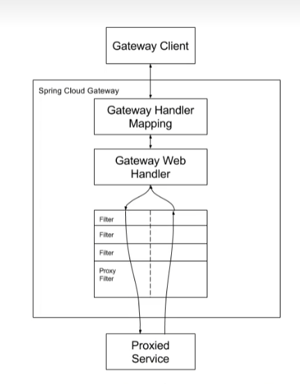
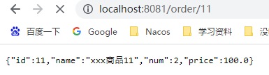
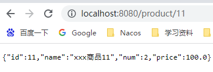
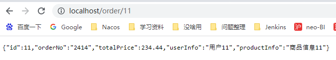

# Gateway

> 提供了统一的路由方式，并且基于Filter链的方式提供网关基本的功能：安全、监控/埋点、限流等；
>



> 三个概念：
>
> 路由：构建网关的基本模块，由ID、目标URL、一系列的Predicates和过滤器Filter组成，如有断言为true，则匹配该路由
>
> 断言：参考java的java.util.function.Predicate,开发人员可以匹配HTTP请求中的所有内容，例如请求头或请求参数，如果请求头与断言相匹配则进行路由
>
> 过滤：Spring框架中GatewayFilter的实例，使用过滤器可以在请求被路由前后对请求进行修改
>


## 示例

新建`gateway_demo`项目

引入maven依赖

```html
<dependencyManagement>
        <dependencies>
            <dependency>
                <groupId>org.springframework.cloud</groupId>
                <artifactId>spring-cloud-dependencies</artifactId>
                <version>Hoxton.SR8</version>
                <type>pom</type>
                <scope>import</scope>
            </dependency>
            <dependency>
                <groupId>org.springframework.boot</groupId>
                <artifactId>spring-boot-dependencies</artifactId>
                <version>2.3.2.RELEASE</version>
                <type>pom</type>
                <scope>import</scope>
            </dependency>
            <dependency>
                <groupId>com.alibaba.cloud</groupId>
                <artifactId>spring-cloud-alibaba-dependencies</artifactId>
                <version>2.2.5.RELEASE</version>
                <type>pom</type>
                <scope>import</scope>
            </dependency>
        </dependencies>
    </dependencyManagement>
```

建两个子模块：一个商品模块（`product-demo`）、一个订单模块（`order-demo`）

引入maven依赖

```html
<dependencies>
        <dependency>
            <groupId>org.springframework.boot</groupId>
            <artifactId>spring-boot-starter-web</artifactId>
        </dependency>

        <dependency>
            <groupId>org.projectlombok</groupId>
            <artifactId>lombok</artifactId>
            <version>1.18.10</version>
        </dependency>
    </dependencies>
```

分别编写接口

```java
@RestController
@RequestMapping("/order")
public class OrderController {

    @GetMapping("/{id}")
    public Order detail(@PathVariable("id")Integer id){
        return new Order(id,"2414",234.44,"用户"+id,"商品信息"+id);
    }
}
```

访问接口（要加上项目配置的端口）



```java
@RestController
@RequestMapping("/product")
public class ProductController {

    @GetMapping("/{id}")
    public Product detail(@PathVariable("id") Integer id) {
        return new Product(id, "xxx商品" + id, 2, 100.00);
    }
}

```

访问接口（要加上项目配置的端口）




加入`gateway`服务模块

`gateway-server`

```html
<dependencies>
        <dependency>
            <groupId>org.springframework.cloud</groupId>
            <artifactId>spring-cloud-starter-gateway</artifactId>
        </dependency>
    </dependencies>
```


```yaml
server:
  port: 80
  servlet:
    context-path: /
spring:
  application:
    name: gateway-server
  cloud:
    gateway:
      routes: #路由规则定义
        - id: product-demo  #路由id
          uri: http://localhost:8080/ #路由地址
          predicates: #断言规则
            - Path=/product/**

        - id: order-demo  #路由id
          uri: http://localhost:8081/ #路由地址
          predicates: #断言规则
            - Path=/order/**
```

经过gateway的转发，<font color="RED">**优雅~**</font>



## predicate 断言类型

### path断言

```
predicates:
- path=/mg/**
```

### Query断言

```yaml
参数值可以写正则，也可以只写参数名
predicates:
- query=foo,ba.
```

### Method断言

```yaml
predicates:
- Method=get
```

### Host断言

```yaml
predicates:
- Host=wzx.cool
```

### Cookie断言

```yaml
predicates:
- cookie=name.wuzhixuan
```

### 时间断言

#### After 时间路由

```yaml
predicates:
- After=2022-02-07T17:05:00.789+08:00[Asia/Shanghai]
```
#### Before 时间路由

```yaml
- Before=2022-02-07T17:05:00.789+08:00[Asia/Shanghai]
```

#### Between时间区间路由

```yaml
- Between=2021-02-07T17:05:00.789+08:00[Asia/Shanghai],2022-02-07T17:05:00.789+08:00[Asia/Shanghai]
```

### Weight 权重路由

```yaml
- id: weight2
  uri: http://localhost:6601
  predicates:
    - Path=/api/**
    - Weight=group1,2
  filters:
    - StripPrefix=1
- id: weight8
  uri: http://localhost:6602
  predicates:
    - Path=/api/**
    - Weight=group1,8
  filters:
    - StripPrefix=1
```

> - web请求，通过一些匹配条件，定位到真正的服务节点。并在这个转发过程的前后，进行一些精细化控制。
> - predicate就是我们的匹配条件;
> - 而filter,就可以理解为一个无所不能的拦截器。有了这两个元素,再加上目标uri,就可以实现一个具体的路由了

## 自定义过滤器

两个接口介绍：globalfilter，ordered

功能：

- 全局日志记录
- 统一网关鉴权

```java
/**
 * 鉴权认证
 *
 * @author 吴志旋
 * 自定义filter 需要实现Ordered 和GlobalFilter
 *  Ordered 优先级 越小优先级越大
 */
@Slf4j
@Component
@AllArgsConstructor
public class AuthFilter implements GlobalFilter, Ordered {
	private final AuthProperties authProperties;
	private final ObjectMapper objectMapper;
	private final AntPathMatcher antPathMatcher = new AntPathMatcher();
 
	@Override
	public Mono<Void> filter(ServerWebExchange exchange, GatewayFilterChain chain) {
		String path = exchange.getRequest().getURI().getPath();
		if (isSkip(path)) {
			return chain.filter(exchange);
		}
		ServerHttpResponse resp = exchange.getResponse();
		String headerToken = "";
		String paramToken ="";
		if (StringUtils.isAllBlank(headerToken, paramToken)) {
			return unAuth(resp, "缺失令牌,鉴权失败");
		}
		String auth = StringUtils.isBlank(headerToken) ? paramToken : headerToken;
		String token = JwtUtil.getToken(auth);
		Claims claims = JwtUtil.parseJWT(token);
		if (claims == null) {
			return unAuth(resp, "请求未授权");
		}
		return chain.filter(exchange);
	}
 
	private boolean isSkip(String path) {
		
	}
 
 
	@Override
	public int getOrder() {
		return -100;
	}
 
}
```
