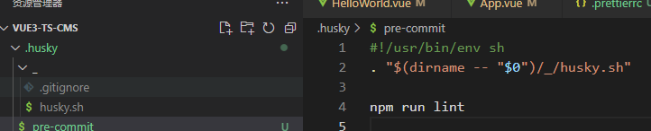

## 使用Vue Cli创建项目

```shell
 vue create name
```


## 统一编程规范[.editorconfig](https://github.com/RehanSaeed/EditorConfig/blob/main/.editorconfig)


```shell
# 顶部的EditorConfig文件
root = true
 
[*]
end_of_line = lf
insert_final_newline = true
indent_style = space
indent_size = 2
charset = utf-8
trim_trailing_whitespace = true

[*.md]
max_line_length = off
trim_trailing_whitespace = false
```

vscode还要安装editorconfig插件，配置才能生效


## 安装prettier 代码格式化工具

### 1、安装prettier (-D表示只在开发阶段生效)

```shell
npm install prettier -D
```

### 2、配置.prettierrc文件：


```yaml
{
    "useTabs": false,
    "tabWidth": 2,
    "printWidth": 80,
    "singleQuote": true,
    "trailingComma": "none",
    "semi": false
}
```

### 3、创建.prettierignore文件

```shell
/dist/*
.local
.output.js
/node_modules/**

**/*.svg
**/*.sh

/public/*
```

### 4、vscode安装prettier插件


### 5、package.json中新建脚本

`scripts`下加入

```yaml
"perttier": "perttier --write ."
```


### 6、测试生效

```shell
npm run prettier
```


### 7、可以配置保存时格式化


## eslint 代码检查

> 检查所有项目组成员的代码规范

### vscode安装ESlint插件


### 需要让eslint和prettier不要冲突

 安装插件

```shell
npm install eslint-plugin-prettier eslint-config-prettier -D
```

<font color="RED">！（由于我们在vue cli创建项目的时候已经选了eslint+prettier ，它就已经帮我安装了）</font>


### 解决不兼容问题

`.eslintrc.js` 加入`'plugin:prettier/recommended'`

```yaml
extends: [
    'plugin:vue/vue3-essential',
    'eslint:recommended',
    '@vue/typescript/recommended',
    'plugin:prettier/recommended'
  ]
```


## git Husky

防止项目组成员git提交不规范的代码


相当于commit之前 进行eslint --fix ；那么怎么做到这一点呢？

我们可以使用Husky工具：husky是一个git hook工具，可以帮助我们触发git提交的各个阶段：pre-commit、commit-msg、pre-push

安装Husky

自动配置Husky命令

```shell
npx husky-init && npm install
```


在`pre-commit`中配置git命令前执行lint命令




这里拦截到git命令，自动执行

## Commitizen

Commitizen是帮助我们编写规范commit message的工具

## 1、安装Commitizen

```shell
npm install commitizen -D
```

## 2、安装cz

```shell
commitizen init cz-conventional-changelog --save-dev --save-exact
```

这个命令帮助我们安装cz-conventional-changelog

安装成功后 会在 package中生生成

```yaml
"config": {
    "commitizen": {
      "path": "./node_modules/cz-conventional-changelog"
    }
  }
```

## 在package中添加

```yaml
 "scripts": {
    "commit": "cz"
  }
```

## 开始提交

```shell
npm add .
npm run commmit
```


