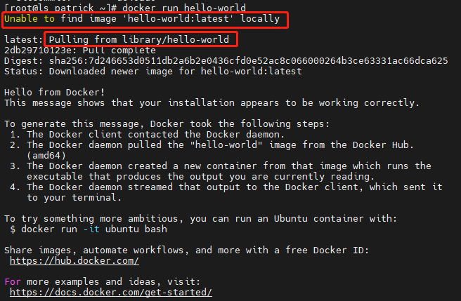

## 查看系统内核和版本

```shell
#系统内核
[root@ls_patrick ~]# uname -r
3.10.0-1160.15.2.el7.x86_64
```

```shell
#系统版本
[root@ls_patrick ~]# cat /etc/os-release
NAME="CentOS Linux"
VERSION="7 (Core)"
ID="centos"
ID_LIKE="rhel fedora"
VERSION_ID="7"
PRETTY_NAME="CentOS Linux 7 (Core)"
ANSI_COLOR="0;31"
CPE_NAME="cpe:/o:centos:centos:7"
HOME_URL="https://www.centos.org/"
BUG_REPORT_URL="https://bugs.centos.org/"

CENTOS_MANTISBT_PROJECT="CentOS-7"
CENTOS_MANTISBT_PROJECT_VERSION="7"
REDHAT_SUPPORT_PRODUCT="centos"
REDHAT_SUPPORT_PRODUCT_VERSION="7"

```


## 参考docker官方文档https://docs.docker.com/

## 卸载旧版本

```shell
[root@ls_patrick ~]# yum remove docker \
                  docker-client \
                  docker-client-latest \
                  docker-common \
                  docker-latest \
                  docker-latest-logrotate \
                  docker-logrotate \
                  docker-engine
```

## docker需要的安装包（环境）

```shell
[root@ls_patrick ~]# yum install -y yum-utils
```

## 设置镜像的仓库

```shell
#官方使用的是国外的
yum-config-manager \
    --add-repo \
    https://download.docker.com/linux/centos/docker-ce.repo
    
#国内推荐使用阿里云的
yum-config-manager \
    --add-repo \
    http://mirrors.aliyun.com/docker-ce/linux/centos/docker-ce.rep 
```

## 安装docker

```shell
[root@ls_patrick ~]# yum install docker-ce docker-ce-cli containerd.io docker-compose-plugin

```

## 启动docker

```shell
[root@ls_patrick ~]# systemctl start docker
```

## 查看docker状态(使用docker version查看是否安装成功)

```shell
[root@ls_patrick ~]# docker version
Client: Docker Engine - Community
 Version:           20.10.17
 API version:       1.41
 Go version:        go1.17.11
 Git commit:        100c701
 Built:             Mon Jun  6 23:05:12 2022
 OS/Arch:           linux/amd64
 Context:           default
 Experimental:      true

Server: Docker Engine - Community
 Engine:
  Version:          20.10.17
  API version:      1.41 (minimum version 1.12)
  Go version:       go1.17.11
  Git commit:       a89b842
  Built:            Mon Jun  6 23:03:33 2022
  OS/Arch:          linux/amd64
  Experimental:     false
 containerd:
  Version:          1.6.7
  GitCommit:        0197261a30bf81f1ee8e6a4dd2dea0ef95d67ccb
 runc:
  Version:          1.1.3
  GitCommit:        v1.1.3-0-g6724737
 docker-init:
  Version:          0.19.0
  GitCommit:        de40ad0
```

## hello world

```shell
[root@ls_patrick ~]# docker run hello-world
```



没有helloworld 就会去docker仓库下载

## 使用docker images查看镜像

```shell
[root@ls_patrick ~]# docker images
REPOSITORY    TAG       IMAGE ID       CREATED         SIZE
hello-world   latest    feb5d9fea6a5   11 months ago   13.3kB
```

## 卸载docker

```shell
[root@ls_patrick ~]# yum remove docker-ce docker-ce-cli containerd.io docker-compose-plugin

[root@ls_patrick ~]# rm -rf /var/lib/docker
[root@ls_patrick ~]# rm -rf /var/lib/containerd
```

