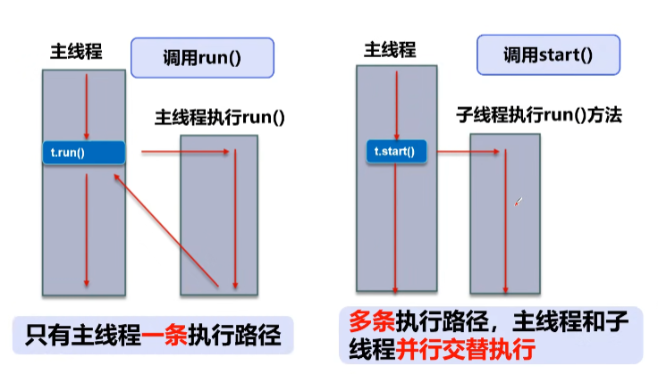
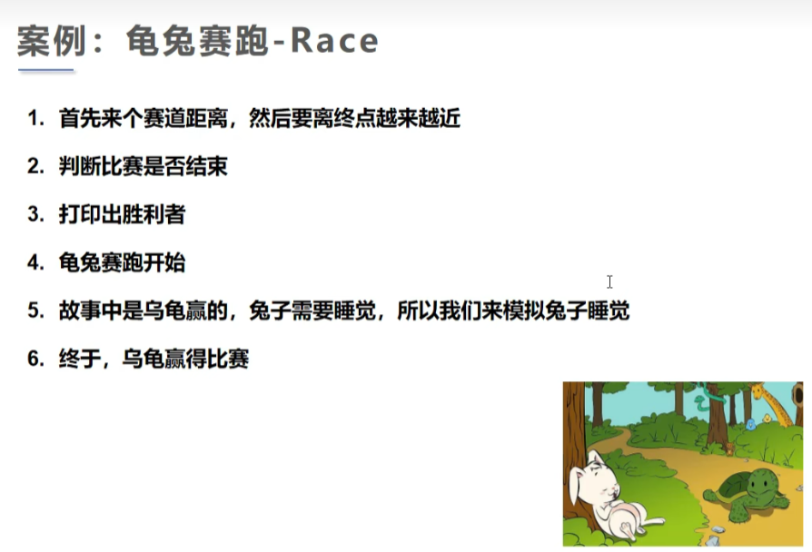
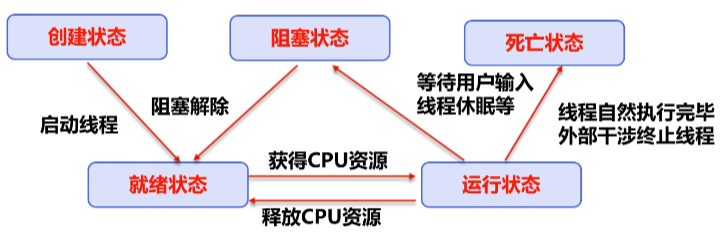
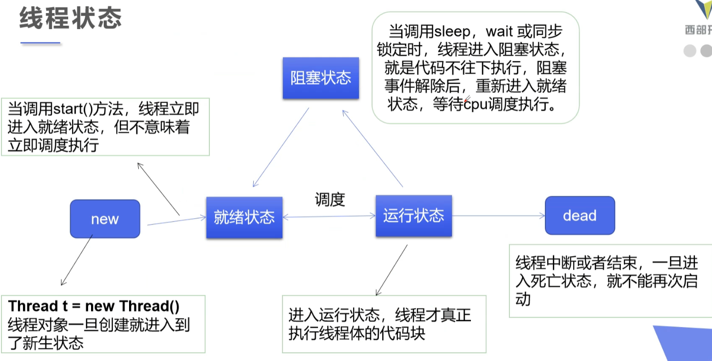
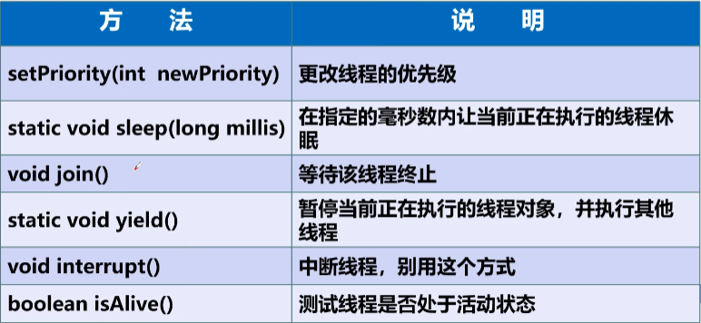
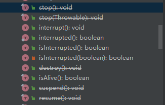
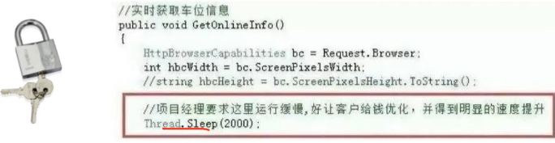
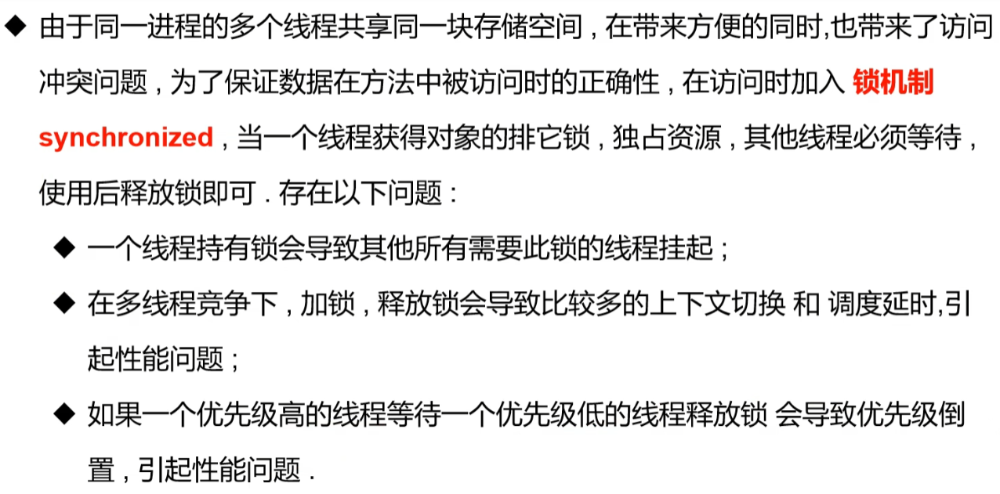

# 线程简介





# 线程实现

## 创建线程方式1：继承Thread类

```java
/**
 * @Author panrenai
 * @Description: 创建线程方式1 ：继承Thread，重写Run方法，调用start开启线程
 * 总结 ：注意，线程开启不一定立即执行，由CPU调度执行
 * @Date 2022/7/26 16:55
 * @Version 1.0
 */
public class TestThread extends Thread{

    @Override
    public void run() {
        for (int i = 0; i < 200; i++) {
            System.out.println("我在看代码-----"+i);
        }
    }

    public static void main(String[] args) {
        //创建线程对象
        TestThread testThread = new TestThread();
        //调用start
        testThread.start();
        for (int i = 0; i < 200; i++) {
            System.out.println("我在学习多线程----"+i);
        }
    }
}

```

### 使用Thread ，实现多线程同步下载图片

```java
/**
 * @Author panrenai
 * @Description: 练习Thread ，实现多线程同步下载图片
 * @Date 2022/7/26 17:11
 * @Version 1.0
 */
public class TestThread2 extends Thread {

    private String url;
    private String name;

    public TestThread2(String url, String name) {
        this.url = url;
        this.name = name;
    }

    //下载图片执行体
    @Override
    public void run() {
        WebDownload webDownload = new WebDownload();
        webDownload.download(url, name);
        System.out.println("下载了文件名为：" + name);
    }

    public static void main(String[] args) {
        TestThread2 t1 = new TestThread2("http://rebp38war.bkt.clouddn.com/img/bg.jpg","1.jpg");
        TestThread2 t2 = new TestThread2("http://rebp38war.bkt.clouddn.com/img/s.jpg","2.jpg");
        TestThread2 t3 = new TestThread2("http://rebp38war.bkt.clouddn.com/img/v2-e3059da37ed8f8f281476c133380e406_r.jpg","3.jpg");
        t1.start();
        t2.start();
        t3.start();
    }

}

//下载器
class WebDownload {

    //下载方法
    public void download(String url, String name) {
        try {
            FileUtils.copyURLToFile(new URL(url), new File(name));
        } catch (IOException e) {
            e.printStackTrace();
        }
    }

}
```
## 创建线程方式2：实现Runnable接口

```JAVA
package com.test.thread;

/**
 * @Author panrenai
 * @Description: 创建线程方式2 ，实现runnable接口，重写run方法，调用start方法
 * @Date 2022/7/27 9:38
 * @Version 1.0
 */
public class TestRunnable implements Runnable{
    @Override
    public void run() {
        for (int i = 0; i < 200; i++) {
            System.out.println("我在看代码-----"+i);
        }
    }

    public static void main(String[] args) {
        //创建线程对象
        TestRunnable testThread = new TestRunnable();
        //创建线程对象，通过线程对象来开启我们的线程，代理
        Thread thread = new Thread(testThread);
        //调用start
        thread.start();
        for (int i = 0; i < 200; i++) {
            System.out.println("我在学习多线程----"+i);
        }
    }
}

```
### 改造实现Runnable ，实现多线程同步下载图片

```JAVA
/**
 * @Author panrenai
 * @Description: 练习Runnable ，实现多线程同步下载图片
 * @Date 2022/7/26 17:11
 * @Version 1.0
 */
public class TestRunnable2 implements Runnable {

    private String url;
    private String name;

    public TestRunnable2(String url, String name) {
        this.url = url;
        this.name = name;
    }

    //下载图片执行体
    @Override
    public void run() {
        WebDownload2 webDownload = new WebDownload2();
        webDownload.download(url, name);
        System.out.println("下载了文件名为：" + name);
    }

    public static void main(String[] args) {
        TestRunnable2 t1 = new TestRunnable2("http://rebp38war.bkt.clouddn.com/img/bg.jpg","1.jpg");
        TestRunnable2 t2 = new TestRunnable2("http://rebp38war.bkt.clouddn.com/img/s.jpg","2.jpg");
        TestRunnable2 t3 = new TestRunnable2("http://rebp38war.bkt.clouddn.com/img/v2-e3059da37ed8f8f281476c133380e406_r.jpg","3.jpg");
        new Thread(t1).start();
        new Thread(t2).start();
        new Thread(t3).start();
    }

}

//下载器
class WebDownload2 {

    //下载方法
    public void download(String url, String name) {
        try {
            FileUtils.copyURLToFile(new URL(url), new File(name));
        } catch (IOException e) {
            e.printStackTrace();
        }
    }

}
```

### 实现简单抢票系统

```JAVA
public class TestThread4 implements Runnable {

    private int tickNum = 10;

    @Override
    public void run() {
        while (true) {
            if (tickNum <= 0) {
                break;
            }
            //模拟延时
            try {
                Thread.sleep(200);
            }catch (InterruptedException e){
                e.printStackTrace();
            }

            // 发现问题：多个线程操作同一个资源的情况下，线程不安全，数据紊乱
            System.out.println(Thread.currentThread().getName() + "--->拿到了第" + tickNum-- + "张票");
        }
    }

    public static void main(String[] args) {
        TestThread4 ticket = new TestThread4();
        new Thread(ticket,"小明").start();
        new Thread(ticket,"老师").start();
        new Thread(ticket,"黄牛党").start();
    }
}
```

```shell
老师--->拿到了第10张票
小明--->拿到了第8张票
黄牛党--->拿到了第9张票
黄牛党--->拿到了第7张票
小明--->拿到了第5张票
老师--->拿到了第6张票
小明--->拿到了第4张票
老师--->拿到了第4张票
黄牛党--->拿到了第4张票
小明--->拿到了第2张票
黄牛党--->拿到了第2张票
老师--->拿到了第3张票
黄牛党--->拿到了第1张票
小明--->拿到了第1张票
老师--->拿到了第1张票

Process finished with exit code 0
```

发现问题：多个线程操作同一个资源的情况下，线程不安全，数据紊乱

### 案例 ：龟兔赛跑



```java
/**
 * @Author panrenai
 * @Description: 模拟龟兔赛跑
 * @Date 2022/7/27 10:24
 * @Version 1.0
 */
public class Race implements Runnable {

    private static String winner;

    @Override
    public void run() {
        for (int i = 0; i <= 100; i++) {

            boolean flag = gameOver(i);
            //如果比赛结束了，就停止比赛
            if (flag) {
                break;
            }
            //模拟兔子睡觉
            if ("兔子".equals(Thread.currentThread().getName()) && i % 10 == 0) {
                try {
                    Thread.sleep(1);
                } catch (InterruptedException e) {
                    e.printStackTrace();
                }
            }

            System.out.println(Thread.currentThread().getName() + "跑了" + i + "步");
        }
    }

    // 判断是否完成比赛
    private boolean gameOver(int steps) {
        //判断是否有胜利者
        if (winner != null) {
            return true;
        }
        //大于或等于100 判定为胜者
        if (steps >= 100) {
            winner = Thread.currentThread().getName();
            System.out.println("Winner is " + winner);
            return true;
        }

        return false;
    }

    public static void main(String[] args) {
        Race race = new Race();
        new Thread(race, "兔子").start();
        new Thread(race, "乌龟").start();
    }
}
```

```
乌龟跑了96步
乌龟跑了97步
乌龟跑了98步
乌龟跑了99步
Winner is 乌龟
兔子跑了20步

Process finished with exit code 0
```

## 创建线程方式3：实现Callable接口

> 步骤
>
> 1. 实现接口，	`implements Callable`
> 2. 重写call方法，定义返回值     `public Boolean call() throws Exception{}`
> 3. 创建执行服务  `ExecutorService service = Executors.newFixedThreadPool(3);`
> 4. 提交执行 `Future<Boolean> r1 = service.submit(t1);`
> 5. 获取结果 `Boolean rs1 = r1.get();`
> 6. 关闭服务 `service.shutdownNow();`
>

Callable的好处

1.可以定义返回值

2.可以抛出异常

3.支持泛型

### 用callable改造多线程同步图片下载

```java
/**
 * @Author panrenai
 * @Description: 线程创建方式三：实现Callable接口
 * @Date 2022/7/27 11:03
 * @Version 1.0
 */
public class TestCallable implements Callable {

    private String url;
    private String name;

    public TestCallable(String url, String name) {
        this.url = url;
        this.name = name;
    }


    @Override
    public Boolean call() throws Exception {
        WebDownload3 webDownload = new WebDownload3();
        webDownload.download(url,name);
        System.out.println("下载了文件名为："+name);
        return true;
    }

    public static void main(String[] args) throws ExecutionException, InterruptedException {
        TestCallable t1 = new TestCallable("http://rebp38war.bkt.clouddn.com/img/bg.jpg","1.jpg");
        TestCallable t2 = new TestCallable("http://rebp38war.bkt.clouddn.com/img/s.jpg","2.jpg");
        TestCallable t3 = new TestCallable("http://rebp38war.bkt.clouddn.com/img/v2-e3059da37ed8f8f281476c133380e406_r.jpg","3.jpg");

        //创建执行服务
        ExecutorService service = Executors.newFixedThreadPool(3);
        //提交执行
        Future<Boolean> r1 = service.submit(t1);
        Future<Boolean> r2 = service.submit(t2);
        Future<Boolean> r3 = service.submit(t3);
        //获取结果
        Boolean rs1 = r1.get();
        Boolean rs2 = r2.get();
        Boolean rs3 = r3.get();
        //打印结果
        System.out.println(rs1);
        System.out.println(rs2);
        System.out.println(rs3);
        //关闭服务
        service.shutdownNow();
    }
}

//下载器
class WebDownload3 {

    //下载方法
    public void download(String url, String name) {
        try {
            FileUtils.copyURLToFile(new URL(url), new File(name));
        } catch (IOException e) {
            e.printStackTrace();
        }
    }

}
```

## 静态代理


好处：

1. 代理对象可以做很多真实对象做不了的事情
2. 真实对象专注做自己的事情


```java
/**
 * @Author panrenai
 * @Description: 静态代理总结：真实对象（目标对象）喝代理对象都要实现一个接口；代理对象要代理真实对象
 * @Date 2022/7/27 15:03
 * @Version 1.0
 */
public class StacticProxy {

    public static void main(String[] args) {
        You you = new You();//你要结婚
        you.HappyMarry();

        WeddingCompany weddingCompany = new WeddingCompany(new You());//由婚庆公司帮你结婚
        weddingCompany.HappyMarry();
    }
}

interface Marry {
    void HappyMarry();
}

//真实角色 ，你去结婚
class You implements Marry {

    @Override
    public void HappyMarry() {
        System.out.println("结婚都是一件美事。");
    }
}

//代理角色，帮助你结婚
class WeddingCompany implements Marry {

    //代理的对象
    private Marry target;

    public WeddingCompany(Marry target) {
        this.target = target;
    }

    @Override
    public void HappyMarry() {
        before();
        this.target.HappyMarry();
        after();
    }

    private void after() {
        System.out.println("结婚之后，收尾款。");
    }

    private void before() {
        System.out.println("结婚之前，布置现场。");
    }
}
```

为什么要提静态代理呢？

```java
new WeddingCompany(new You()).HappyMarry();
new Thread(() -> System.out.println("我爱你")).start();
```

可以看出 Thread类和静态代理的原理一毛一样，相当与Thread也是一个代理，通过代理（实现Runnable接口），扩展了功能

# 线程状态

>​	五大状态：创建状态、就绪状态、阻塞状态、运行状态、死亡状态







## 线程停止

> 很多JDK提供的停止方法已经不推荐使用了（已废弃），比如stop() destory()方法
>
> ​	

推荐线程自己停下来

建议使用一个标志位进行终止变量，当flag=false，则终止线程

```java
/**
 * @Author panrenai
 * @Description: 测试停止线程
 * @Date 2022/7/29 9:50
 * @Version 1.0
 */
public class TestStop implements Runnable {

    //1.设置一个标志位
    private boolean flag = true;

    @Override
    public void run() {
        int i = 0;
        //建议线程正常停止--->不建议死循环
        while (flag) {
            System.out.println("run ...Thread" + i++);
        }
    }

    //自己定义stop方法
    public void stop() {
        this.flag = false;
    }

    public static void main(String[] args) {
        TestStop testStop = new TestStop();
        new Thread(testStop).start();
        for (int i = 0; i < 1000; i++) {
            System.out.println("main" + i);
            if (i == 900) {
                //调用stop方法
                testStop.stop();
                System.out.println("线程停止了");
            }
        }
    }
}
```

### 线程休眠 sleep()

`sleep()`

- sleep(time)指当前线程阻塞的毫秒值;
- sleep 存在异常`InterruptedException`;
- sleep时间达到后，线程进入就绪状态
- sleep可以模拟网络延时，倒计时等。
- **每个对象都有一个锁，sleep不会释放锁**





```java
try {
    //模拟延时
    Thread.sleep(200);
}catch (InterruptedException e){
    e.printStackTrace();
}
```


### 线程礼让 yield()

`yield()`

- 礼让线程，让当前正在执行的线程停止，但不阻塞
- 将线程从运行状态转为就绪状态
- **让CPU重新调度，礼让不一定成功！看CPU心情！**

```java
/**
 * @Author panrenai
 * @Description: 测试礼让线程：礼让不一定成功，看CPU心情
 * @Date 2022/7/29 10:15
 * @Version 1.0
 */
public class TestYield {

    public static void main(String[] args) {
        MyYield myYield = new MyYield();
        new Thread(myYield,"A").start();
        new Thread(myYield,"B").start();
    }
}

class MyYield implements Runnable{
    @Override
    public void run() {
        System.out.println(Thread.currentThread().getName()+"线程开始执行");
        //礼让线程
        Thread.yield();
        System.out.println(Thread.currentThread().getName()+"线程停止执行");
    }
}
```

### 线程强占 join()

`join()`

- join合并线程。待线程执行完成后，再执行其他线程，其他线程阻塞
- 可以想象成插队

```java
/**
 * @Author panrenai
 * @Description: 测试Join
 * @Date 2022/7/29 10:30
 * @Version 1.0
 */
public class TestJoin implements Runnable {
    @Override
    public void run() {
        for (int i = 0; i < 1000; i++) {
            System.out.println("线程VIP来了" + i);
        }
    }

    public static void main(String[] args) throws InterruptedException {
        TestJoin testJoin = new TestJoin();
        Thread thread = new Thread(testJoin);
        thread.start();

        //主线程
        for (int i = 0; i < 500; i++) {
            if (i == 200) {
                //插队； join后将要等待此线程执行完
                thread.join();
            }
            System.out.println("main"+i);
        }
    }
} 
```

## 观测线程状态

- 查看JDK API文档

  ```java
  public static enum Thread.State extends Enum<Thread.State>
  ```

  线程状态。线程可以处于以下状态之一：

  - [`NEW`](../../java/lang/Thread.State.html#NEW)  
    尚未启动的线程处于此状态。 
  - [`RUNNABLE`](../../java/lang/Thread.State.html#RUNNABLE)  
    在Java虚拟机中执行的线程处于此状态。 
  - [`BLOCKED`](../../java/lang/Thread.State.html#BLOCKED)  
    被阻塞等待监视器锁定的线程处于此状态。 
  - [`WAITING`](../../java/lang/Thread.State.html#WAITING)  
    正在等待另一个线程执行特定动作的线程处于此状态。 
  - [`TIMED_WAITING`](../../java/lang/Thread.State.html#TIMED_WAITING)  
    正在等待另一个线程执行动作达到指定等待时间的线程处于此状态。 
  - [`TERMINATED`](../../java/lang/Thread.State.html#TERMINATED)  
    已退出的线程处于此状态。 

  一个线程可以在给定时间点处于一个状态。 这些状态是不反映任何操作系统线程状态的虚拟机状态。 

如何检测呢？

```java
/**
 * @Author panrenai
 * @Description: 测试检测线程状态
 * @Date 2022/7/29 14:29
 * @Version 1.0
 */
public class TestState {
    public static void main(String[] args) throws InterruptedException {
        Thread thread = new Thread(() -> {
            for (int i = 0; i < 5; i++) {
                try {
                    Thread.sleep(1000);
                } catch (InterruptedException e) {
                    e.printStackTrace();
                }
            }
            System.out.println("//////");
        });

        //刚创建的情况
        Thread.State state = thread.getState();
        System.out.println(state);//输出NEW

        //刚启动的情况
        thread.start();
        state = thread.getState();
        System.out.println(state);//输出RUNNABLE
        
        while (state != Thread.State.TERMINATED) {
            Thread.sleep(100);
            state = thread.getState();
            System.out.println(state);//线程未执行完输出TIMED_WAITING 线程执行完输出TERMINATED
        }
    }
}

```

控制台输出信息：
```
NEW
RUNNABLE
TIMED_WAITING
TIMED_WAITING
TIMED_WAITING
//////
TERMINATED
```

## 线程的优先级

`getPriority()`

`setPriority()`

```java
/**
 * @Author panrenai
 * @Description: 测试线程优先级
 * @Date 2022/7/29 14:45
 * @Version 1.0
 */
public class TestPriority {

    public static void main(String[] args) {
        //主线程默认优先级
        System.out.println(Thread.currentThread().getName()+"--->"+Thread.currentThread().getPriority());
        MyPriority myPriority = new MyPriority();
        Thread t1 = new Thread(myPriority);
        Thread t2 = new Thread(myPriority);
        Thread t3 = new Thread(myPriority);
        Thread t4 = new Thread(myPriority);
        Thread t5 = new Thread(myPriority);
        Thread t6 = new Thread(myPriority);

        t1.start();//默认优先级 5
        t2.setPriority(1);
        t2.start();
        t3.setPriority(4);
        t3.start();
        t4.setPriority(Thread.MAX_PRIORITY);//MAX_PRIORITY 10  NORM_PRIORITY 5 MIN_PRIORITY 1
        t4.start();
        t5.setPriority(8);
        t5.start();
        t6.setPriority(3);
        t6.start();
    }
}

class MyPriority implements Runnable{

    @Override
    public void run() {
        System.out.println(Thread.currentThread().getName()+"--->"+Thread.currentThread().getPriority());
    }
}
```

观察输出台

```
main--->5
Thread-0--->5
Thread-3--->10
Thread-4--->8
Thread-1--->1
Thread-2--->4
Thread-5--->3
```

发现 优先级的设置意味着获得调度的概率改变，并不保证调度必定按照优先级来调度，还都是看cpu的心情；<!--像极了想中500w的你为了能中奖而多买了几注彩票，却发现多为福利彩票捐献了零花钱 -->

## 守护线程（daemon）

`setDaemon(true/false)`

- 线程分为**用户线程**和**守护线程**
- 虚拟机必须确保用户线程执行完毕
- 虚拟机不用等待守护线程执行完毕
- 如：后台记录操作日志、监控内存、垃圾回收等待

```java
/**
 * @Author panrenai
 * @Description: 测试守护线程（上帝守护你）
 * @Date 2022/7/29 15:04
 * @Version 1.0
 */
public class TestDeamon {
    public static void main(String[] args) {
        God god = new God();
        You you = new You();
        Thread thread = new Thread(god);
        thread.setDaemon(true);//默认是false表示是用户线程；正常都是用户线程。。。
        thread.start();//上帝守护线程启动

        new Thread(you).start(); //你 用户线程启动

    }
}

class God implements Runnable{

    @Override
    public void run() {
        while (true){
            System.out.println("上帝保佑着你");
        }
    }
}

class You implements Runnable{
    @Override
    public void run() {
        for (int i = 0; i < 36500; i++) {
            System.out.println("你一生都开心的活着");
        }
        System.out.println("=========Goodbye ! World !=========");
    }
}
```

*上帝一直保佑你直到你挂了为止<u>（You用户线程 结束后，God守护线程 也结束）</u>*


# 线程同步

多个线程操作同一个资源

并发：<font color="RED">同一个对象</font>被<font color="RED">多个线程</font><font color="BLUE">同时操作</font>


## 线程同步 `synchronized`：<font color="RED">队列 + 锁</font> 




## 三大不安全案例


# 线程通信问题

# 高级主题
