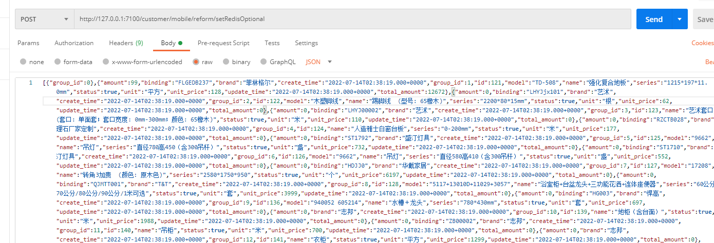
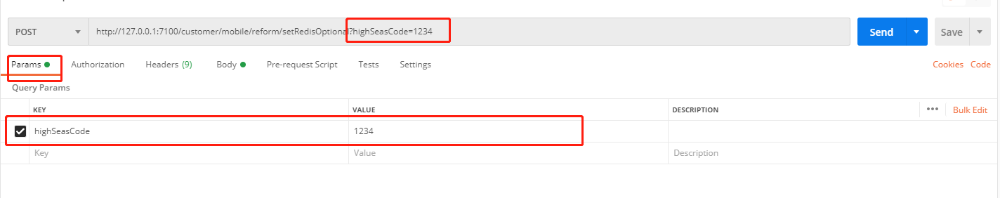
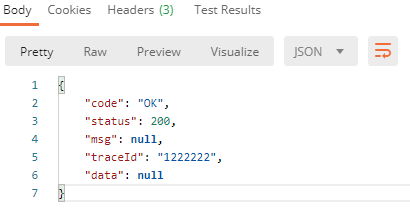

## 同时使用@RequestBody与@RequestParam

**@RequestBody**，主要用来接受前端传给后端的json字符串中的数据，使用postman测试时，数据应该以json字符串的形式放在body里

**@RequestParam**，作用就是将前端传过来的请求参数和后台控制器的方法参数进行绑定，使用postman测试时，数据应当以key-value的形式放入param里

**使用场景及注意事项：**

> @RequestBody传的参数主要是json字符串，@RequestParam传的参数可以是基本元素，数组，对象，集合等。
>
> 场景：我需要接收一段前端传来json体保存到Redis中，
>
> 我希望Redis的Key也由前端传递而来，如果这个key拼到json中，处理将变得复杂和耦合，这时候，我们想是否可以定义两个对象来接收？当然可以。
>
> 但是我需要用@RequestBody 来接收json ，那另一个字段呢？一个请求只能有一个@RequestBody，却可以有多个@RequestParam ；
>
> 这就给我们思路了，使用一个 @RequestBody 和一个@RequestParam 来解决问题

~~~java
    @PostMapping("/setRedisSpace")
    public ApiResponse setRedisSpace(@RequestBody ReqVO reqVO, @RequestParam("highSeasCode") String highSeasCode) {
        HsmjRedisConstant hsmjRedisConstant = new HsmjRedisConstant(HsmjRedisConstant.CRM_REDIS.getCode() + ":jugai:HighSeasCode:" + highSeasCode);
        valueRedisTemplate.set(hsmjRedisConstant, JSON.toJSONString(reqVO), TimeUnit.DAYS.toSeconds(1));
        return ApiResponse.success();
    }
~~~

这样我们同时可以接收两个对象；

那问题来了。我们自己使用postman测试，该怎么操作呢

一般我们postman传json都是放在raw中，那第二个参数怎么放呢

可以放到Params中。可以看到url中拼接了highSeasCode这个参数

从结果可以看出，请求体里的参数是被后端成功接收了。由此，成功散花！

