# 操作系统

> 操作系统分为：批处理操作系统、分时操作系统、实时操作系统、网络操作系统、分布式操作系统、嵌入式操作系统、微内核操作系统等。
>
> 操作系统主要功能是对处理器、进程、存储、设备、文件和作业进行管理。

## 进程管理

进程是程序在一个数据集合上运行的过程（==程序执行的过程==）；是系统进行资源分配和调度的一个独立单位。

进程分为：程序块、PCB（进程控制块）、数据块

PCB：是进程的唯一标识

进程两个基本属性：

- 可拥有资源的独立单位；

- 可独立调度和分配资源的基本单位

  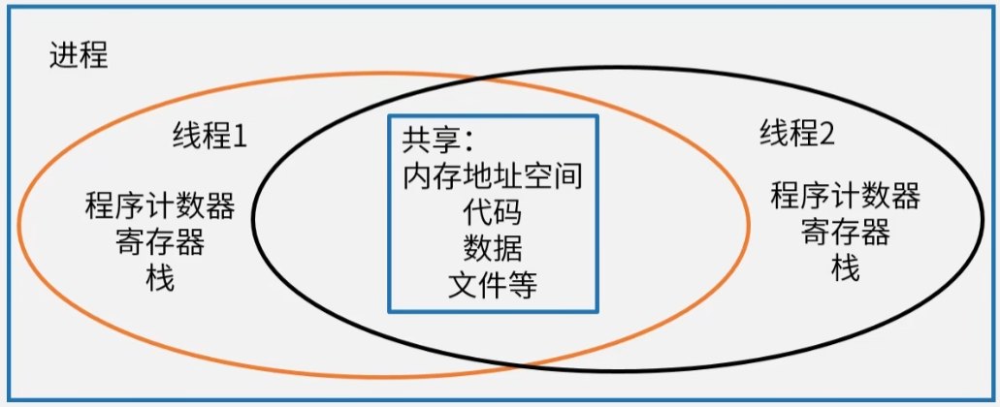

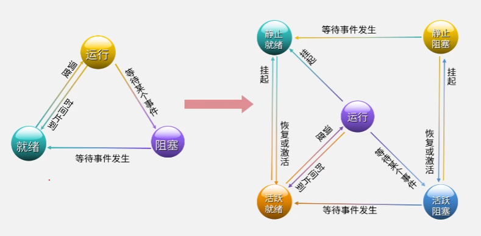

### PV操作

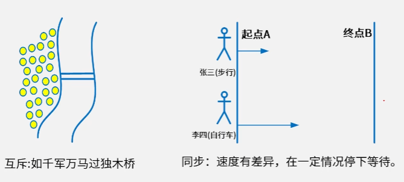

临界资源：诸进程之间需要互斥方式对其进行*共享*的资源，如打印机、磁带机等

临界区：每个进程中访问临界资源的那段*代码*称为临界区

信号量：是一种特殊的变量,全局变量

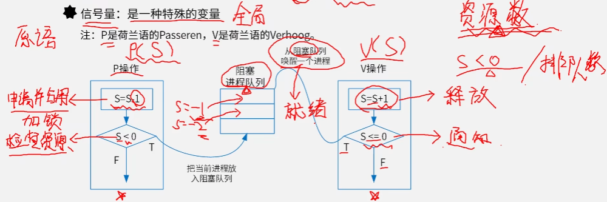

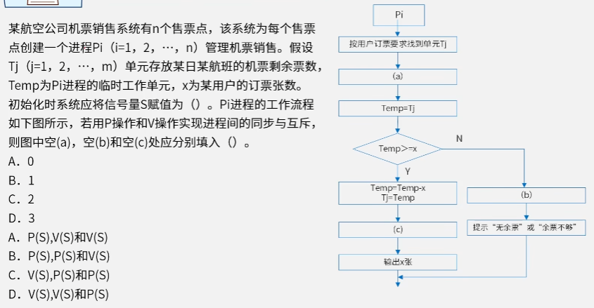

BA

前驱图与PV操作

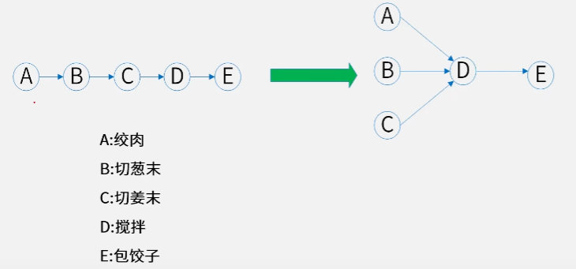

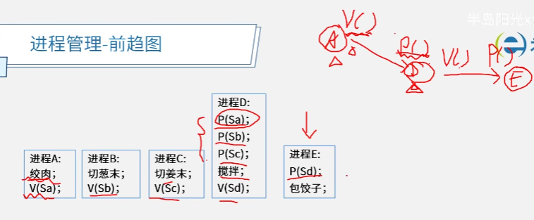

==箭头 流出位置都是V操作，流入操作都是P操作==

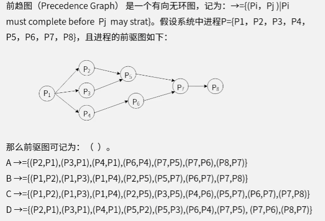

<u>**C**</u>

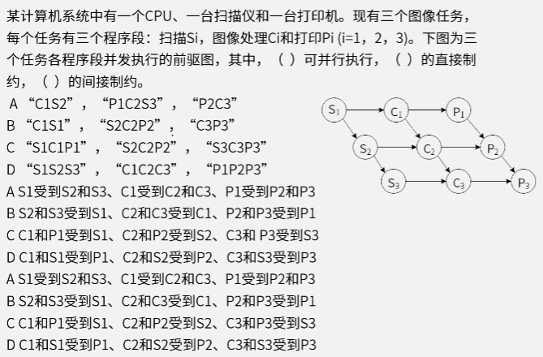

不满足前驱后继关系的才满足并行执行：C1S1 、P1C2S3 、P2C3

直接制约关系 是受到前后顺序的影响：C1、P1受到S1的直接制约...

资源上的限制 就是间接制约关系

如：扫描会受到扫描仪的限制 即S2、S3受到S1的间接制约关系 图像处理受到CPU的间接制约关系...

<u>**ACB**</u>

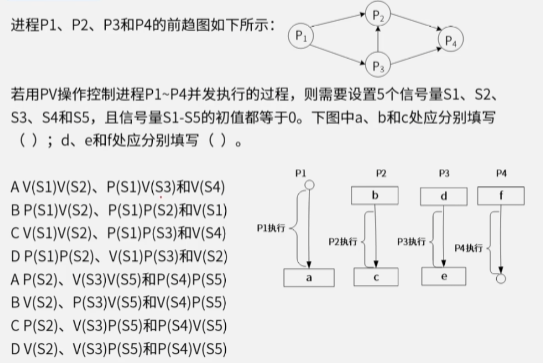

流出位置都是V操作，流入操作都是P操作

<u>**CA**</u>

### 死锁

进程管理师操作系统的核心，但如果设计不当，就会出现死锁的问题，如果一个进程在等待一件不可能发生的事情，则进程就死锁了，而如果一个或多个进程产生死锁，就会造成系统死锁

死锁的避免

- 有序资源分配法
- 银行家算法

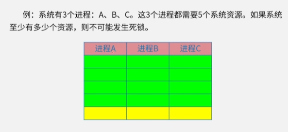

m= 3 w =5

n>= m (w-1)+1     n>=13

## 存储管理

### 页式存储

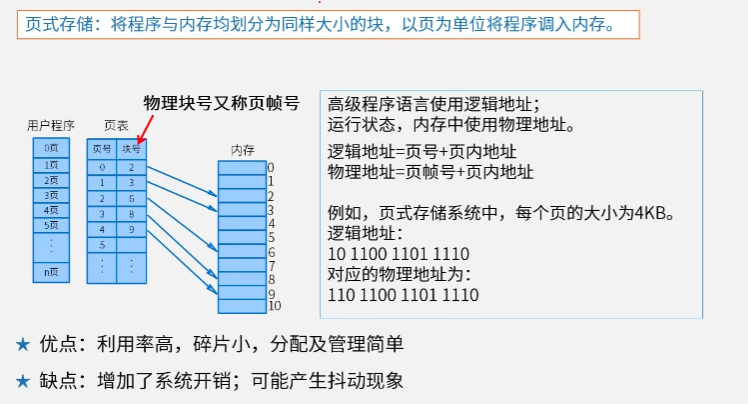

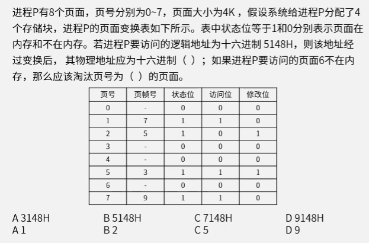

大小为4k（2^12），逻辑地址16进制 5148H ；一位16进制对应4位2进制 ；现在12位二进制对应3位16进制，所以5148H中148H是页内地址，页内地址是不会发生变化的，能变化的只能是高位的5；查表可得页号为5的对应叶帧号为3；所以物理地址16进制为3148H

淘汰优先访问位为0的，查表可得 淘汰2

<u>**AB**</u>

### 段式存储

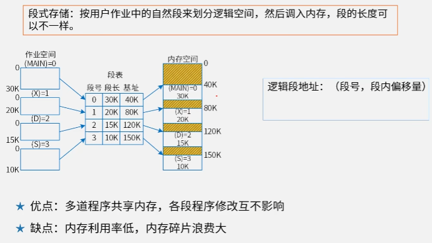

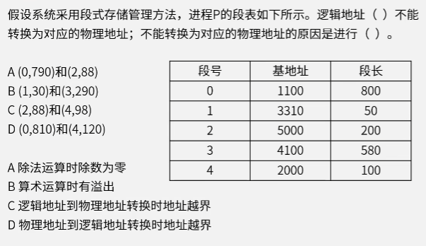

非法的段地址不能转换；(0,790)前一个是段号，后一个是段长 根据段号看数值是否在段长范围内，是逻辑地址到物理地址转换时地址越界

<u>**DC**</u>

### 段页式存储

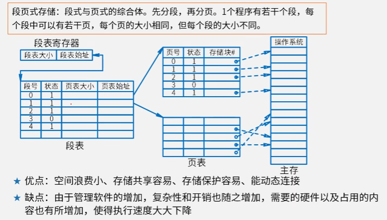

先分段再分页

## 文件管理

### 索引文件结构

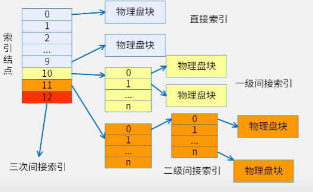

文件在逻辑上一定是连续的，在物理上可以是分散的

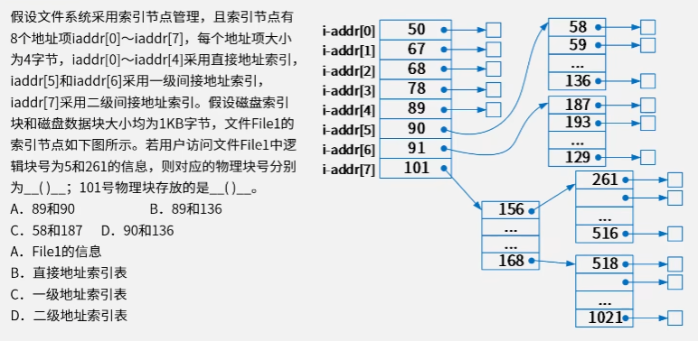

<u>**CA**</u>

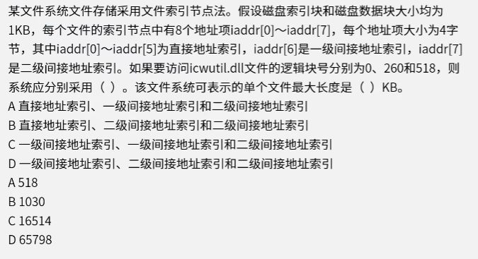

直接逻辑地址 0~5 长度为6，1kb/4b =256  一级索引逻辑地址 x-6+1 =256； x = 261 一级索引逻辑地址 6~261，二级索引逻辑地址 256^2 = 65536 ，262~65536

单个文件最大长度为 直接逻辑地址长度加上一级索引逻辑地址长度加上二级索引逻辑地址长度然后乘以单个块大小  = （6+256+65536 ）* 1kb = 65798

<u>**AD**</u>

### 位示图

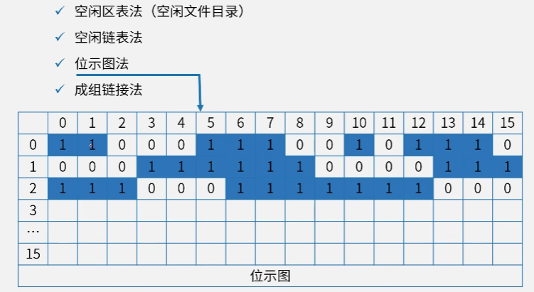

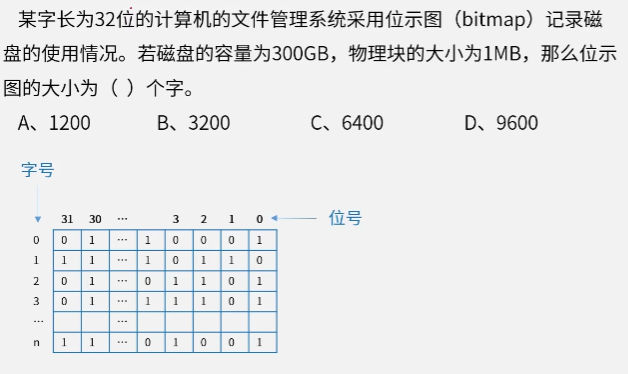

一个磁盘块 为1bit 。300GB.一个物理块为1MB，那么位示图大小等于 300GB/1MB =300x2^10  ；一字等于32bit 所以 300x2^10/32  等于30x2^5 = 9600

<u>**D**</u>

### 树形目录文件

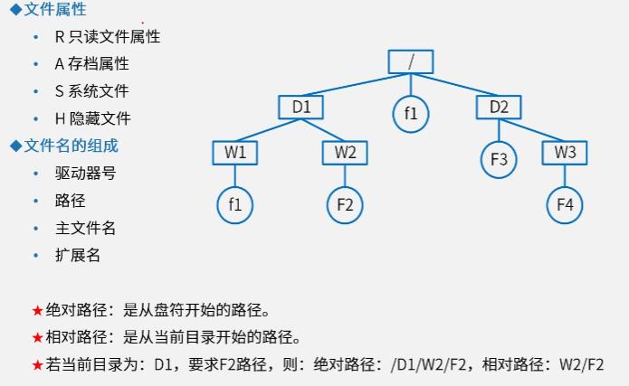

树形目录结构也称为多级目录结构

## 嵌入式操作系统（EOS）

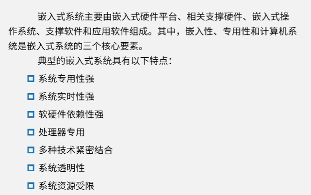

### 嵌入式操作系统特点

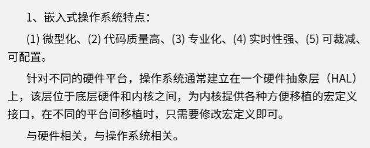

### 交叉编译模型

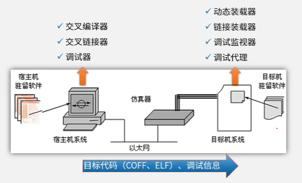

## 实时操作系统（RTOS）

### 实时性能指标

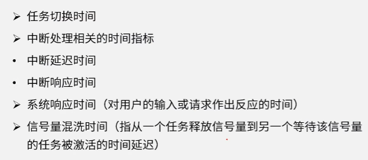

### 多任务调度算法

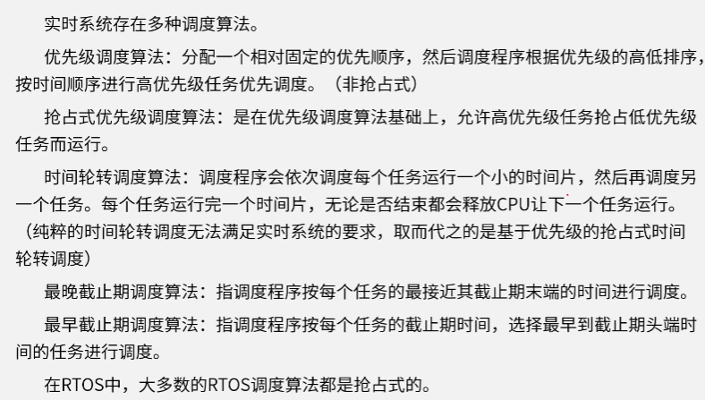

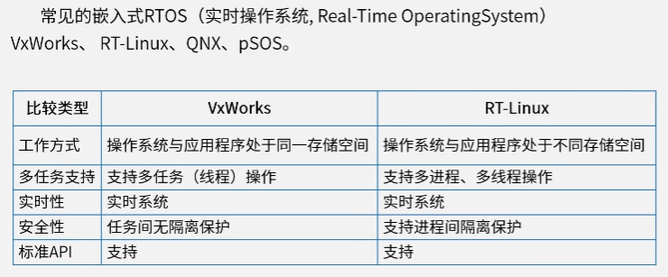

## 微内核操作系统

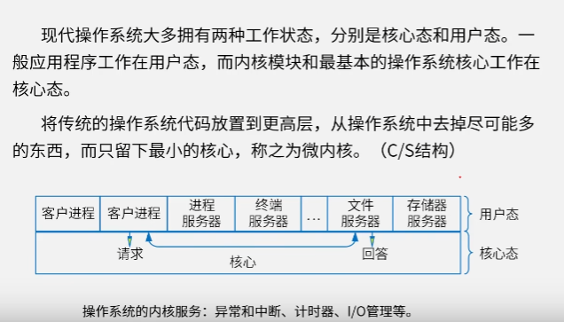

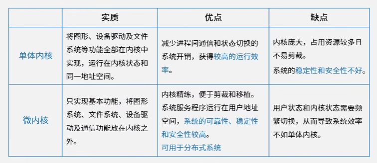

# 计算题

1. **进程调度算法**
2. **PV操作**
3. **页面置换算法**
4. **移臂调度算法**
5. unix的i结点
6. 银行家算法
7. 可变分区
8. 快表访问时间
9. 磁盘旋转优化分布
10. 记录的成组
11. 虚拟叶式存储地址转换
12. 目录项分解法

## 1、进程调度算法

算法题

1. 先来先服务
2. 最短进程优先
3. 最高响应比优先
4. 最高优先级算法 

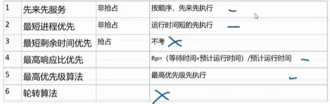

0时刻进入不用算减法

## 2、PV操作

p操作是刹车，v操作是油门

填空题

互斥在同个进程，同步在不同进程。同时有同步和互斥，同步在先。

## 3、页面置换算法

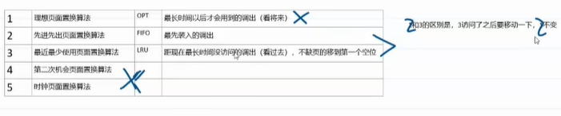

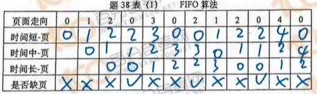

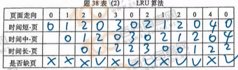

## 4、磁盘调度算法

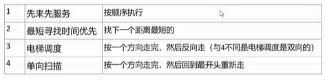

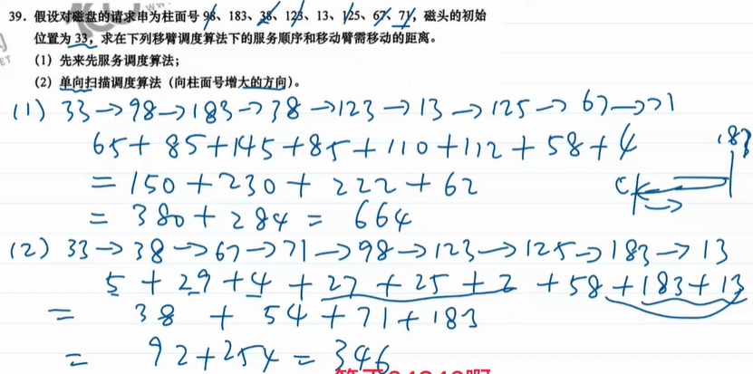

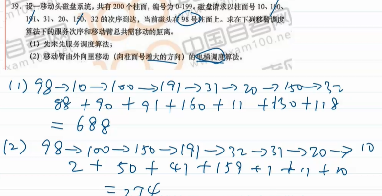

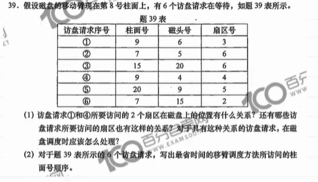

（1）柱面相同 ；2、6；同一柱面统一调度

（2）最省时间：最短寻找时间算法

