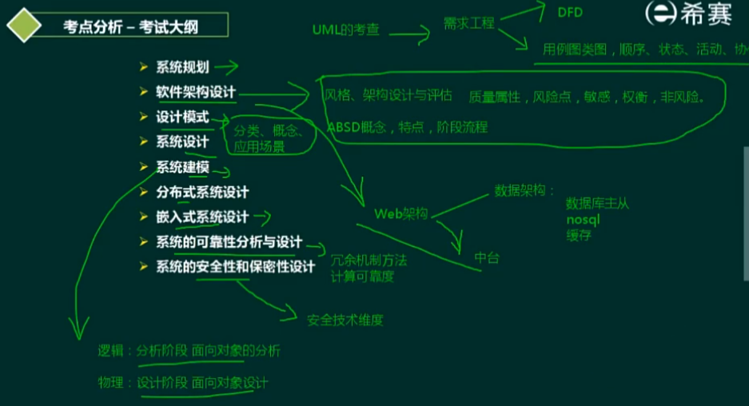
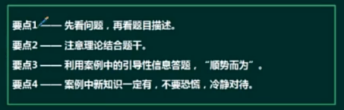
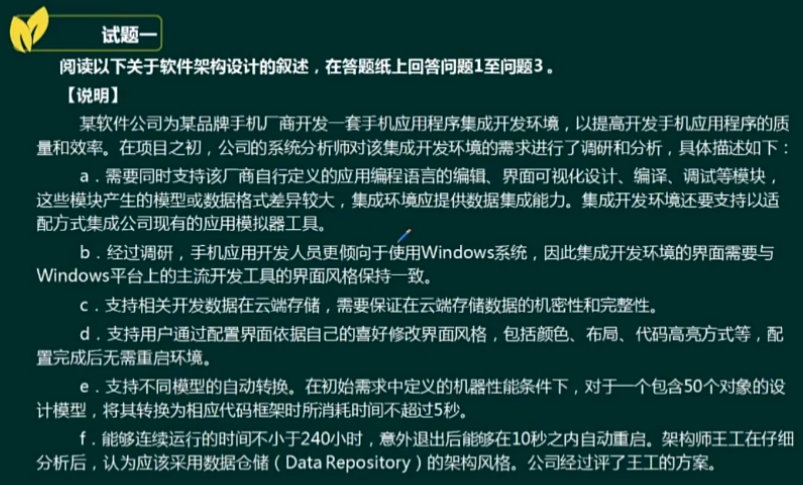
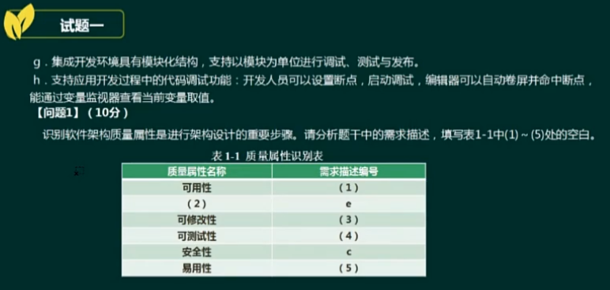
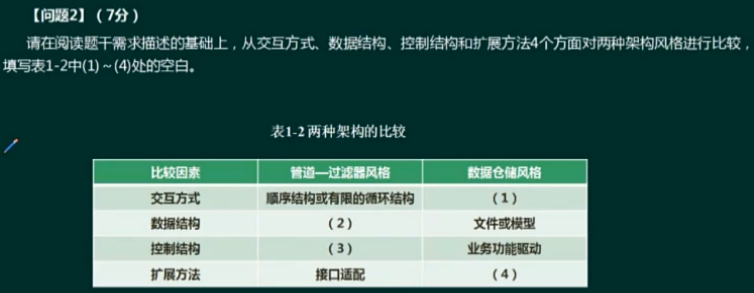
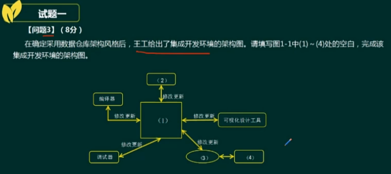

# 案例分析

质量属性的四大核心属性：==**性能、可用性、安全、可修改性**==，其他还有可测试性、易用性

**f 、性能、d、g、b**

**星形结构，以数据为中心，其他构件围绕数据，进行交互的结构、数据流、数据驱动、依赖于中心数据结构的适配**

**语法树、语言编辑、适配器、模拟工具**

系统架构风险 是指架构设计中潜在的、存在问题的架构决策所带来的隐患。

敏感点是指为了实在某种特定的质量属性，一个或多个构件所具有的特性

权衡点是指影响多个质量属性的特性，是多个质量属性的敏感点