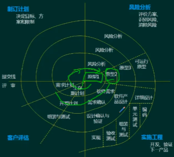

# 软件工程

软件工程即 **工程化的思想去做软件**

> 最早期输入输出的方式就是打孔的方式。原来一个人很短能搞定的事情，现在需要很多人一起去完成，软件领域又比较虚化，运行的时候才能看到最终的效果或结果。对完成软件开发带来很大的风险，交付过程中有很多的问题，品质不可控。我们希望软件开发能像建房子那种工程项目一样，拔地而起又比较受控，所以软件工程是与建造领域有异曲同工之妙。

软件工程包括：

- 软件开发方法
- 需求工程
- 软件系统建模
- 系统设计
- 测试与评审
- 系统运行与软件维护

## 软件开发方法

- **软件开发方法***
- **软件开发模型***
- 逆向工程
- 净室软件工程

### 软件开发方法

#### 结构化法

- 用户至上
- 严格区分工作阶段，每阶段有任务与成果
- 强调系统开发过程的整体性和全局性
- 系统开发过程工程化，文档资料标准化
- 自顶向下，逐步分解（求精）

应变能力差：业务流程固化在代码中，修改困难，而业务流程是可能随时变化的

#### 原型法

- 适用于需求不明确的开发
- 包括抛弃原型和进化型原型

用于需求分析阶段

#### 面向对象方法

- 更好的复用性
- 关键在于建立一个全面、合理、统一的模型
- 分析、设计、实现三个阶段，界限不明确（做前一个工作很可能把后面的部分工作也做了）

#### 面向服务方法

- SO方法的三个主要抽象级别：操作、服务、业务流程
- SOAD分为三个层次：基础设计层（底层服务构件）、应用结构层（服务之间的接口和服务级协定）和业务组织层（业务流程建模和服务流程编排）
- 服务建模：分为服务发现、服务规约和服务实现三个阶段

## 软件开发模型

什么是模型：

​	模板？开发一个软件没有思路？没关系~套一个模板就可以了。

软件开发模型包含了软件开发流程和规定

### 瀑布模型

是结构化方法的玲离尽致的展现

适用于需求明确的项目

### 螺旋模型

以原型为基础加上瀑布模型，不断迭代到可行阶段

适合于大型项目  ：引入了风险分析

### 增量模型

完成一个模块，再增量完成下一个模块

### V模型、喷泉模型、RAD

V模型：

测试贯彻始终的模型

测试尽早做，提前做（测试计划）

喷泉模型：

RAD（快速应用开发）：

构件组装模型：

### 统一过程（UP|RUP）

> 典型特点就是<u>用例驱动</u>、<u>以架构为中心</u>、<u>迭代</u>和<u>增量</u>

用例驱动？

进行软件开发的过程中，是用什么驱动力来推动整个过程。用例驱动表示一开始我们会构建用例，然后用用例一步一步实现出来，测试的时候也会依据用例设计一系列设计用例；

什么是架构呢？

比如我们建房子，先把框架搭起来。

什么是迭代和增量？

软件开发过程中不是一次性完成，而是走多轮迭代，每一轮会有增量

#### 统一过程把一个项目分为四个不同的阶段

### 敏捷方法

以人为本、迭代、循环渐进的开发方法。适合于小型项目，具有小步快跑的思想

#### 四大价值观

- 沟通（加强面对面沟通）
- 简单（不过度设计）
- 反馈（及时反馈）
- 勇气（接受变更的勇气）

#### 常见的敏捷开发方法：

#### Scrum:

### 逆向工程

从最终的产品去反推他的设计和分析

### 净室工程

用理论来证明你写的代码是正确的、是没有瑕疵的

