# 软件架构设计

> 架构的本质
>
> - 软件架构为软件系统提供了一个**结构、行为和属性的高级抽象**
>
> - 软件架构风格是特定应用领域的**惯用模式**，架构定义一**个词汇表和一组约束**
>
> 架构的作用
>
> - 软甲架构师**项目干系人进行交流的手段**
> - 软件架构师**可传递和可复用的模型**，通过研究软件架构可能预测软件的质量
> - 软件架构使推理和控制的更改更加简单，**有助于循序渐进的原型设计**，可以作为培训的基础

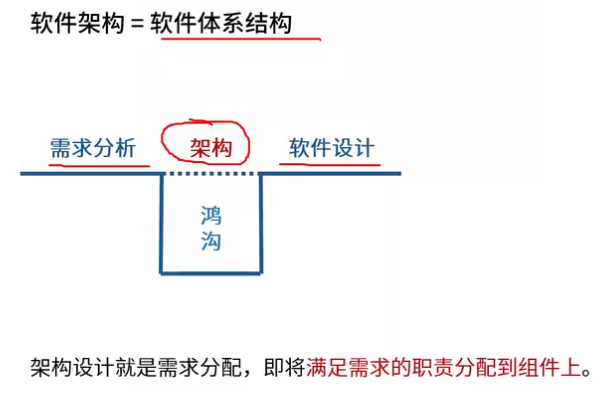

## 架构的4+1视图

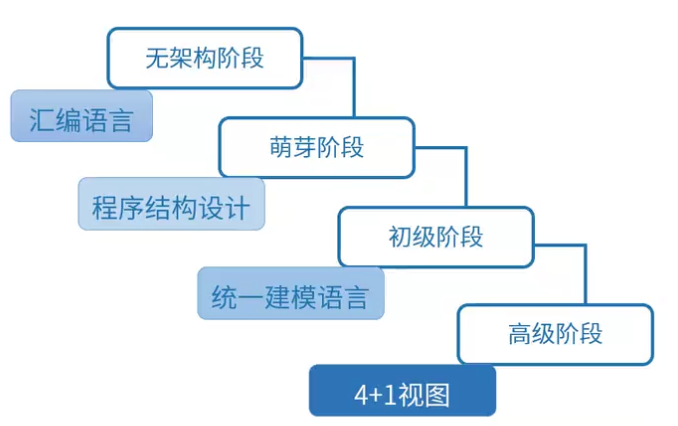

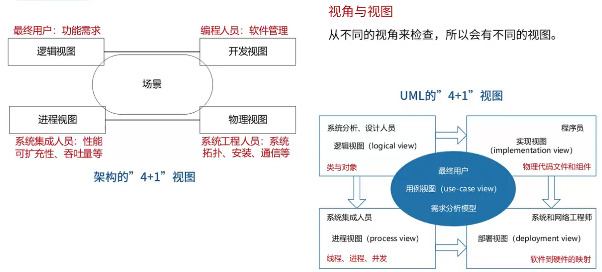

## 软件架构风格

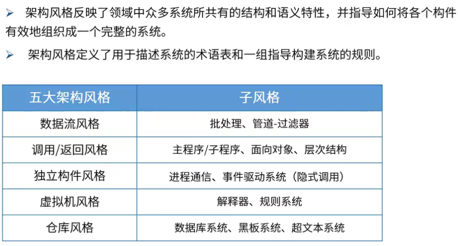

### 数据流风格

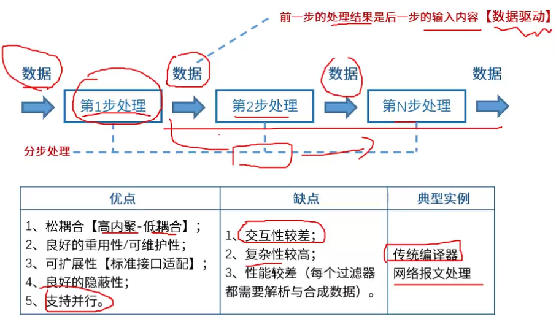

数据流风格两大分支：

1. 批处理序列：大量的**整体**数据、无需用户交互
2. 管道-过滤器：**流式数据**、弱用户交互

### 调用/返回风格

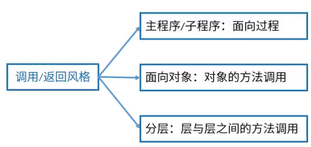

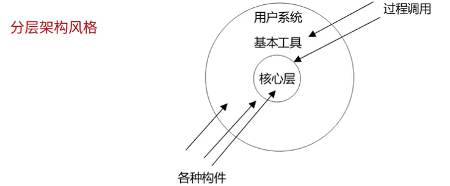

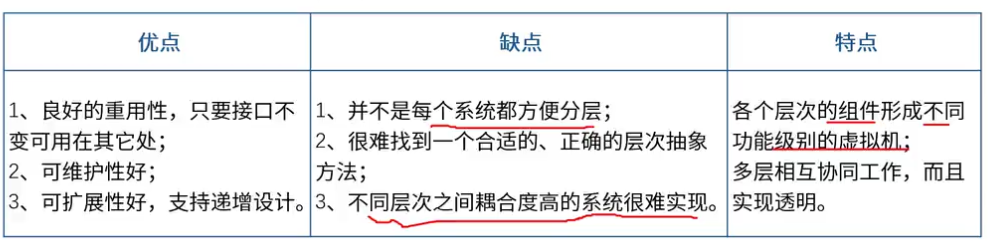

### 独立构件风格

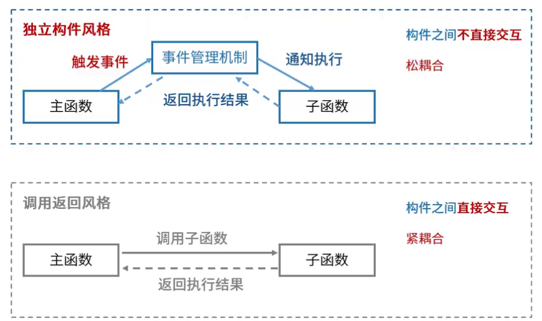

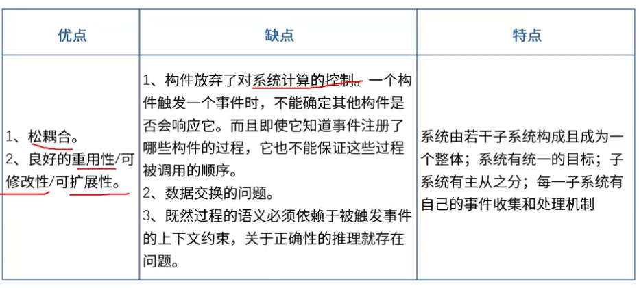

### 虚拟机风格

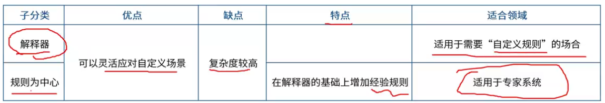

### 仓库风格

以数据为中心

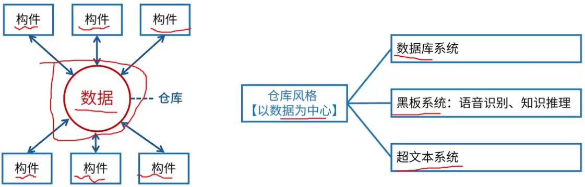

黑板系统

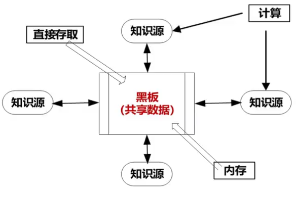

和数据库风格的区别：增加了中心数据变动出发业务逻辑部件

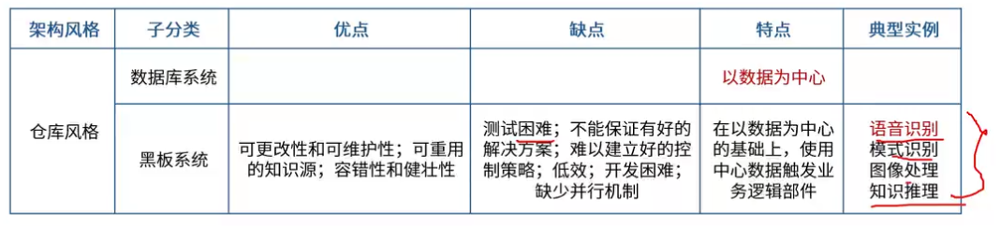

### 闭环控制架构（过程控制）

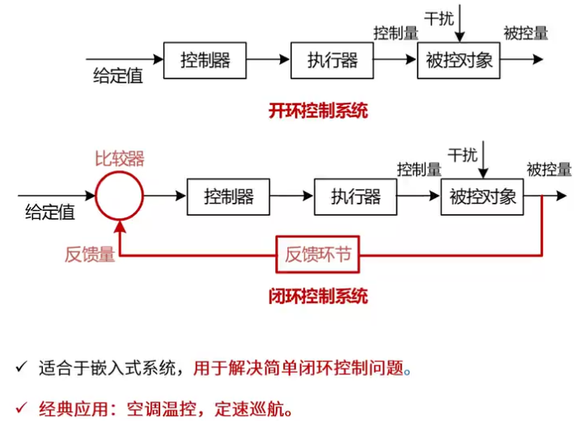

### C2风格

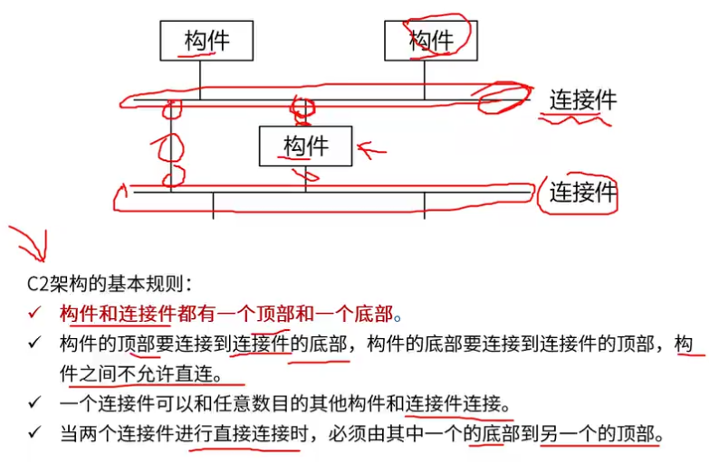

### 层次架构风格

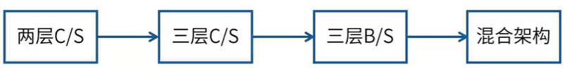

#### 两层C/S

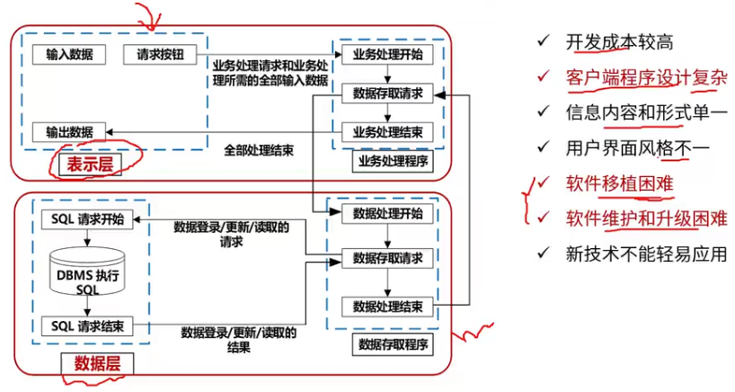

#### 三层C/S

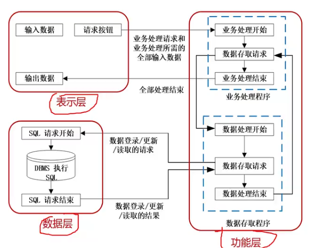

#### 三层B/S

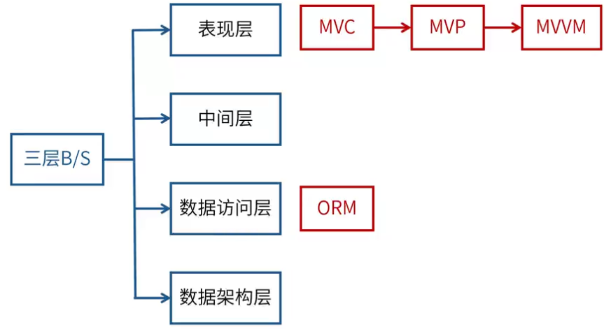

### RIA架构风格

RIA（富互联网结构）

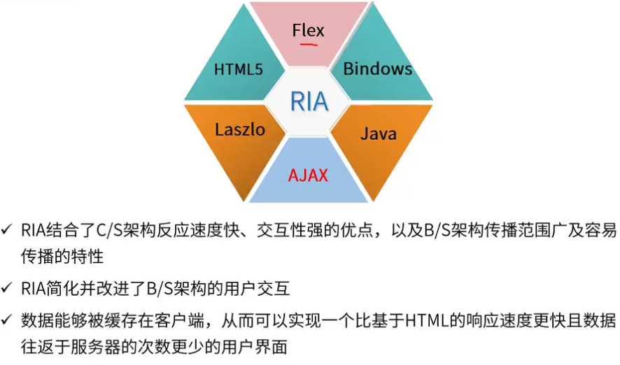

### SOA（面向服务架构）

