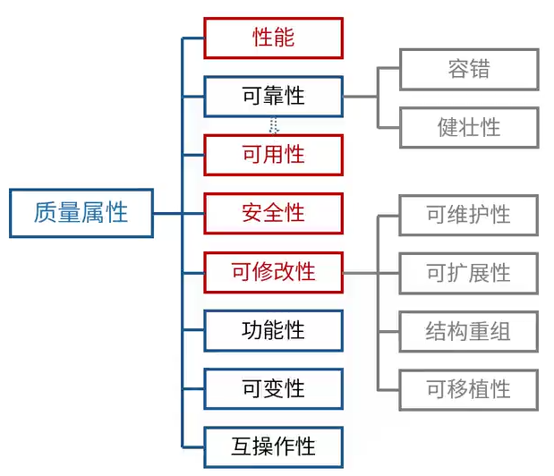

# 软件架构设计

> 架构的本质
>
> - 软件架构为软件系统提供了一个**结构、行为和属性的高级抽象**
>
> - 软件架构风格是特定应用领域的**惯用模式**，架构定义一**个词汇表和一组约束**
>
> 架构的作用
>
> - 软甲架构师**项目干系人进行交流的手段**
> - 软件架构师**可传递和可复用的模型**，通过研究软件架构可能预测软件的质量
> - 软件架构使推理和控制的更改更加简单，**有助于循序渐进的原型设计**，可以作为培训的基础

## 架构的4+1视图

## 软件架构风格

### 数据流风格

数据流风格两大分支：

1. 批处理序列：大量的**整体**数据、无需用户交互
2. 管道-过滤器：**流式数据**、弱用户交互

### 调用/返回风格

### 独立构件风格

### 虚拟机风格

### 仓库风格

以数据为中心

黑板系统

和数据库风格的区别：增加了中心数据变动出发业务逻辑部件

### 闭环控制架构（过程控制）

### C2风格

### 层次架构风格

#### 两层C/S

#### 三层C/S

#### 三层B/S

### RIA架构风格

RIA（富互联网结构）

### SOA（面向服务架构）

- 服务构件**粗粒度**，传统构件细粒度居多
- 服务构件的**接口是标准**的，主要是**WSDL**接口，传统构件常以具体API形式出现
- 服务构件的实现**与语言无关**，传统构件绑定某种特定语言
- 服务构件可以通过构件容器提供**QoS**的服务，传统构件完全由程序代码直接控制

#### SOA的实现方式-WebService

#### SOA的实现方式-ESB

ESB（服务总线）：更倾向于把各种服务串联起来

### 微服务

微服务架构是一种架构模式，它提倡将单一应用程序划分为一组小的服务，服务之间互相协调、互相配合，为用户提供最终价值。

特点

- 小，企鹅专注于做一件事情
- 轻量级的通信机制
- 松耦合、独立部署

#### 微服务与SOA的区别

### ADL（架构描述语言）

### DSSA（特定领域软件架构）

#### 基本活动

#### 领域分析机制

#### 三层次模型

## 基于架构的软件开发方法（ABSD）

### 开发过程

## 架构评估

### 质量属性

### 敏感点、权衡点、风险点、非风险点

### 架构评估方法

基于场景的主要架构评估方法

- 软件架构分析法（SAAM）
- 架构权衡分析法（ATAM）
- 成本效益分析法（CBAM）

#### SAAM

#### ATAM

