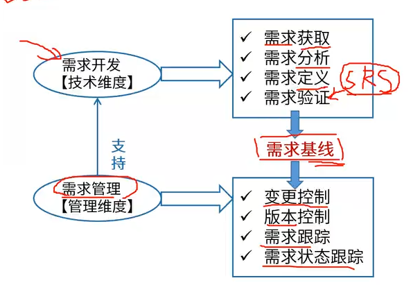
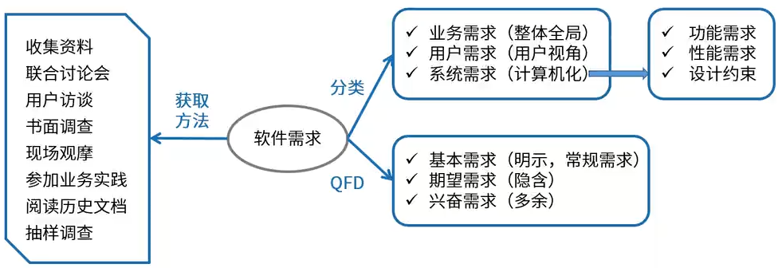
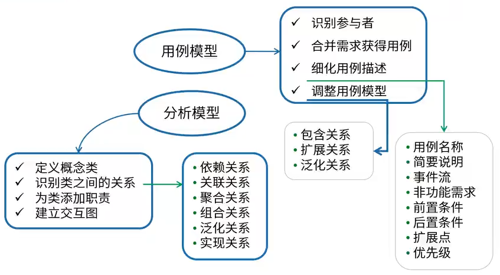
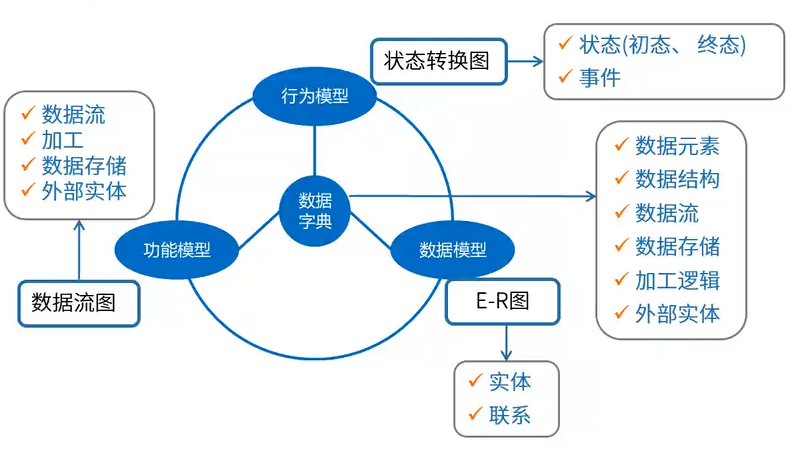
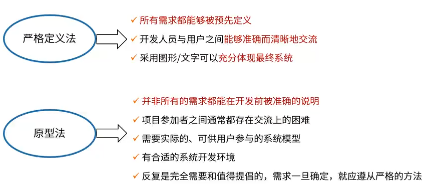
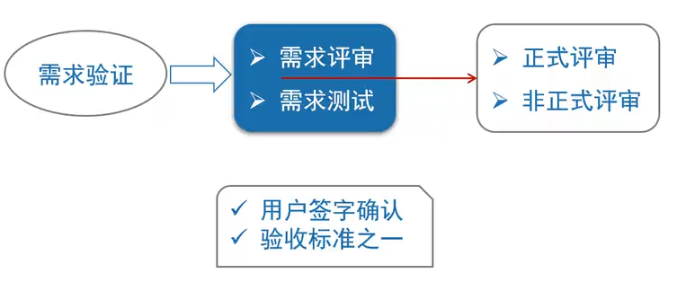
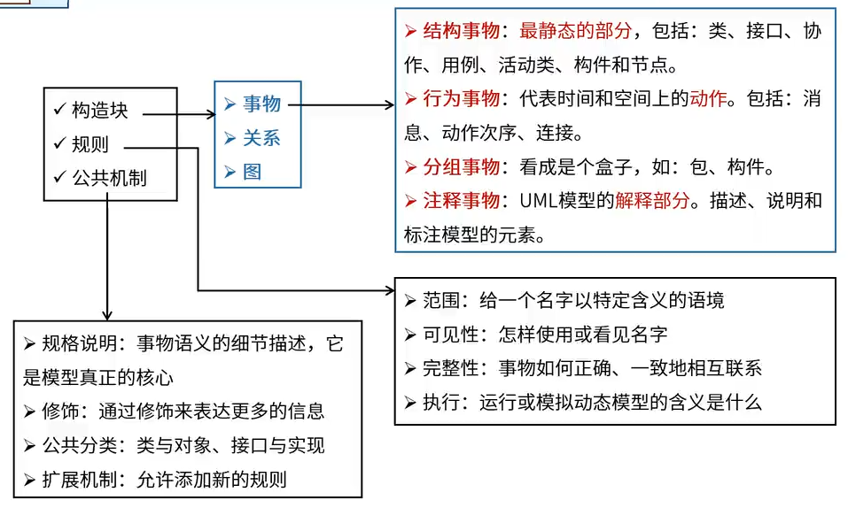
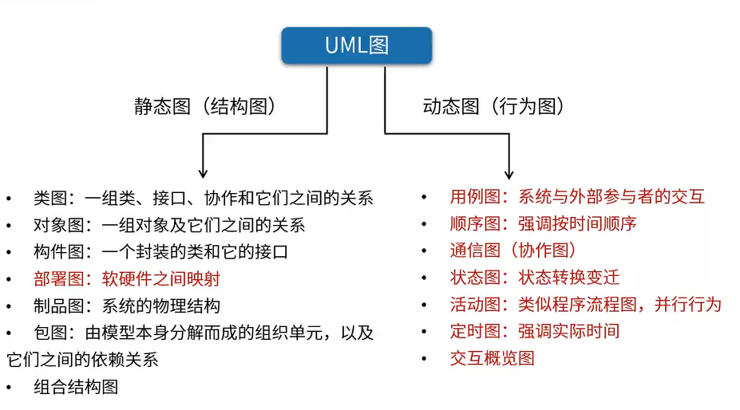
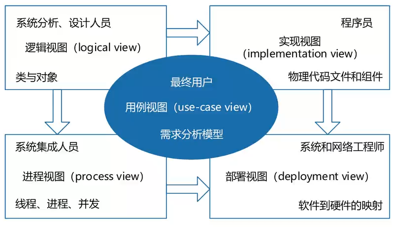

# 需求工程

## 软件需求

软件需求是指用户对系统在<u>功能、行为、性能、设计约束</u>等方面的期望。

需求开发：需求获取、需求分析、需求定义、需求验证

需求管理：变更控制、版本控制、需求跟踪、需求状态跟踪

### 需求获取

### 需求分析                                    

#### 结构化需求分析

DFD（数据流图）

E-R图（实体-联系图）

#### 面向对象需求分析

### 需求定义

### 需求验证

已经完成了<u>需求规格说明书</u>（SRS），已经落地成文档

## UML

统一建模语言（UML）

### UML4+1视图*

每一种视图有自己关注的点

逻辑视图：功能 

实现视图：代码实现

进程视图：并发

部署视图：软件到硬件的映射
