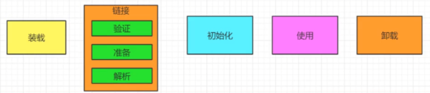
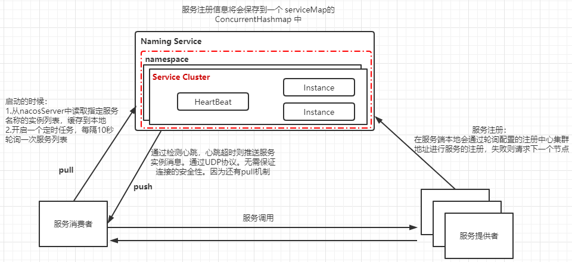

### Spring是什么

是一个容器框架 用来装JAVA bean 

是一个中间层框架 （万能胶） 起到一个连接作用，比如MVC和mybatis 粘合在一起，开发更快、更简洁

是一个生态：可以构建Java应用所需的一切基础设施

Spring 是一个轻量级的控制反转(IOC)和面向切面(AOP)的容器框架

​	--轻量级 （大小和开销）相比EJB

​	--IOC达到松耦合

​	--AOP 允许分离应用的业务逻辑与系统级服务进行内聚性（切面）的开发 （日志等）

​	--管理对象（BEAN）的生命周期

​	--将组件（Mybatis等）整合（集成）到整个应用中来


### Spring的优缺点是什么？

（IOC）集中管理了对象，对象和对象之间的耦合度减低。方便维护对象，（单例多例等）

（AOC）在不修改代码的情况下，可以对业务代码进行增加（减少重复代码、提高开发效率、方便维护）：如日志、监控等与业务方法不相关的代码

（声明事务）提高开发效率，只要一个简单注解（@Transactional）

（方便测试）Spring使用Junit4非常方便测试SpringBean SpringMVC

（集成了各种优秀框架） 拥有非常强大的粘合度（集成能力强），只要简单的配置就可以集成第三方框架

（降低了JAVA API的使用难度）对很多API（功能性代码）进行了简易封装，使用更加简单方便（如JDBC、JAVAMail、远程调用等）

（设计模式）通过源码，spring底层的实现、反射。。设计模式都是值得我们学习，提供了非常多的扩展接口供外部进行扩展

缺点：

​	从应用层面来说没有多大的缺点

​	简化了开发，如果想深入到底层去了解就非常困难（上层使用越简单、底层封装的越复杂）

​	源码缺点：由于Spring大而全（要集成这么多框架、提供了非常多的扩展点，经过十多年的迭代），代码量非常庞大，一百多万 对于深入学习源码带来一定困难。


### IOC是什么？有什么作用？优点是什么？

控制反转：控制了什么，？

​		```--UserService service = new UserService(); //耦合度高（比如说 改成别的对象，要将每个依赖了User Service的类进行更改，），维护不方便 （要将UserService变成单例对象，每个依赖都new一个的话，性能损耗，维护不方便）```

引入IOC 就是将对象的控制权交给了Spring的IOC，以前是自己创建new ，现在就交给Spring的IOC去创建，如果要去使用，需要通过DI（依赖注入）@AutoWired 自动注入 就可以使用对象

优点：集中管理了对象、方便维护、降低耦合度；支持加载服务时的饿汉式和懒汉式

IOC的实现机制是什么？

工厂+反射实现   ：工厂（beanFactory）加反射 帮助我们创建对象

IOC和DI 的区别是什么？

### 紧耦合和松耦合的区别？如何编写松耦合的代码？

紧耦合：

​	紧密耦合是指类之间高度依赖

松耦合：

​	是通过促进<u>单一职责</u>和<u>关注点分离</u>、<u>依赖倒置</u>的设计原则来实现

### BeanFactory的作用

spring中非常核心的一个顶层接口

它的主要职责就是生产Bean

它实现了简单工厂的设计模式，通过getBean传入标识生产一个Bean

### ArrayList和LinkedList的区别

都实现了List接口，

#### String str = "i" 和String str = new String("1")一样吗？

不一样，因为内存的分配方式不一样。String str = "i"的方式JVM会将其分配到常量池中，而String str = new String("i")JVM会将其分配到堆内存中。

#### 20.谈谈你对多态的理解？

多态就是指程序中定义的引用变量所指向的具体类型和通过该引用变量发出的方法调用在编程时并不确定，而是在程序运行期间才确定，即一个引用变量到底会指向哪个类的实例对象，该引用变量发出的方法调用到底是哪个类中实现的方法，必须在程序运行期间才能决定。因为在程序运行时才确定具体的类，这样，不用修改源代码，就可以让引用变量绑定到各种不同的对象上，从而导致该引用调用的具体方法随之改变，即不修改程序代码就可以改变程序运行时所绑定的具体代码，让程序可以选择多个运行状态，这就是多态性。

Java中的hashCode方法就是根据一定的规则将与对象相关的信息（比如对象的存储地址，对象的字段等）映射成一个数值
所以有：
如果两个对象的equals()是true, 那么这两个对象的hashCode就一定相等。
列如：a.equals(b)==true 就一定会有 a.hashCode()==b.hashCode();
反之，两个对象的hashCode相同，他们不一定会equals()==true

注意：
有些设计需要重写equals(),重写equals（）时，最好同时重写hashCode（）
因为在HashSet、HashMap以及HashTable这些中，一般是先判断列表中是否有hashCode，如果有才会用equals（）判断是否相等的。
hashCode没有重写，如果在第一步判断就失败了，equals（）就不会判断了。
所以：
equals方法和hashCode方法始终在逻辑上保持一致性

结论：
如果两个对象相等，那么他们的hashCode一定相同
如果两个对象的hashCode不相同，那么两个对象就一定不相等
如果两个对象的hashCode相同，两个对象也不一定相等。




类加载机制其实就是虚拟机把Class文件加载到内存，并对数据进行校验，转换解析和初始化，形成可以被虚拟机直接使用的Java类型，即为java.lang.Class

装载

1通过一个类的**全限定名**获取这个类的二进制字节流

2将这个字节流所代表的静态存储结构转换为方法区的运行时数据结构

3在Java堆中生成一个代表这个类的java.lang.Class对象，作为我们方法区的数据访问入口

链接

1验证：保证我们加载的类的正确性

​	文件格式验证

​	元数据验证

​	字节码验证

​	符号引用验证

2 准备：为类的静态变量分配内存，并为其初始化为当前类型的默认值

private static int a = 1; 那么他在准备阶段 a = 0；

3解析

把类中的符号引用（文件内部的引用关系）转换成直接引用（内存中的引用关系）

初始化

1执行到class init方法，为静态变量赋值。初始化静态代码块，初始化当前类的父类

### JVM 内存结构

##### 栈 存放基础类型以及对堆的对象引用（线程私有）--碗 吃自己碗里的

##### 堆 存放对象 （线程共有） --锅 大家一起吃

##### 程序计数器 记录当前指令执行的位置   --存档

##### 方法区 存放运行时常量池，类信息

##### 本地方法 栈 其他语言编写的，由java运行的

## SpringCloud

SpringCloud是基于SpringBoot的分布式微服务架构；他将市面上成熟的、经过验证的微服务框架整合起来，并通过 Spring Boot 的思想进行再封装，屏蔽调其中复杂的配置和实现原理；使我们能轻松实现微服务架构系统的构建

### 微服务

由于单体架构的耦合性高、稳定性差、部署成本大等原因。将系统根据拆分原则（单一职责、服务粒度适中、演进式拆分）拆分成不同大小的微服务

微服务的优劣势：独立的微服务，彻底的去耦合，利于分工，在复杂程度上来说，微服务比单体建构要更为复杂些；部署比单体项目复杂；服务之间是用HTTP协议通信的，通信成本比单体项目高
数据一致性问题。

SpringCloud Alibaba组件

Nacos 注册中心(服务发现/注册)

Nacos 配置中心(动态配置管理)

Gateway：API网关

Feign: 调用远程服务

Sentinel:服务容错(限流、降级、熔断)

### Nacos注册中心 :

微服务架构中每个微服务都会向注册中心去注册自己的地址及端口信息，注册中心维护着服务名称与服务实例的对应关系

每个微服务都会定时从注册中心获取服务列表，同时汇报自己的运行情况，这样当有的服务需要调用其他服务时，就可以从自己获取到的服务列表中获取实例地址进行调用



### Nacos配置中心 :

在没有配置中心之前，传统应用配置的存在以下痛点：

（1）采用本地静态配置，无法保证实时性：修改配置不灵活且需要经过较长的测试发布周期，无法尽快通知到客户端，还有些配置对实时性要求很高，比方说主备切换配置或者碰上故障需要修改配置，这时通过传统的静态配置或者重新发布的方式去配置，那么响应速度是非常慢的，业务风险非常大

（2）易引发生产事故：比如在发布的时候，容易将测试环境的配置带到生产上，引发生产事故。

（3）配置散乱且格式不标准：有的用properties格式，有的用xml格式，还有的存DB，团队倾向自造轮子，做法五花八门。

（4）配置缺乏安全审计、版本控制、配置权限控制功能：谁？在什么时间？修改了什么配置？无从追溯，出了问题也无法及时回滚到上一个版本；无法对配置的变更发布进行认证授权，所有人都能修改和发布配置。

        而配置中心区别于传统的配置信息分散到系统各个角落的方式，对系统中的配置文件进行集中统一管理，而不需要逐一对单个的服务器进行管理。那这样做有什么好处呢？

（1）通过配置中心，可以使得配置标准化、格式统一化

（2）当配置信息发生变动时，修改实时生效，无需要重新重启服务器，就能够自动感知相应的变化，并将新的变化统一发送到相应程序上，快速响应变化。比方说某个功能只是针对某个地区用户，还有某个功能只在大促的时段开放，使用配置中心后只需要相关人员在配置中心动态去调整参数，就基本上可以实时或准实时去调整相关对应的业务。

（3）通过审计功能还可以追溯问题


DataID  前缀-环境-扩展名 （服务名+运行环境.yaml）

@Value() 导入配置

@RefreshScope配置发布之后，动态刷新配置

 Nacos 引入命名空间 Namespace 的概念来进行多环境配置和服务的管理及隔离 如：Dev、Test、Prod

### GatewayAPI网关：

Gateway是在Spring生态系统之上构建的API网关服务。Gateway旨在提供一种简单而有效的方式提供了统一的路由方式，以及提供一些强大的过滤器功能


动态路由：能够匹配任何请求属性

可以对路由指定 Predicate（断言）和 Filter（过滤器）；

断言类型丰富：path、host、时间、权重等

支持路径重写

自定义过滤器：实现两个接口globalfilter，ordered

功能例如：

- 全局日志记录
- 统一网关鉴权

### Feign 调用远程服务：


## Mysql

myisam 支持全文检索、压缩、空间函数等，不支持事务和行级锁，不支持外键，索引和数据分开存储；一般用于大量查询少量插入的场景使用

innodb 基于B+Tree索引建立，和myisam相反，它支持事务、外键；并且支持高并发，索引和数据存储在一起


索引是存储引擎层实现的；不同的存储引擎具有不同的索引库；

B+Tree是大多数Mysql引擎的默认索引类型

### 什么是B+Tree

